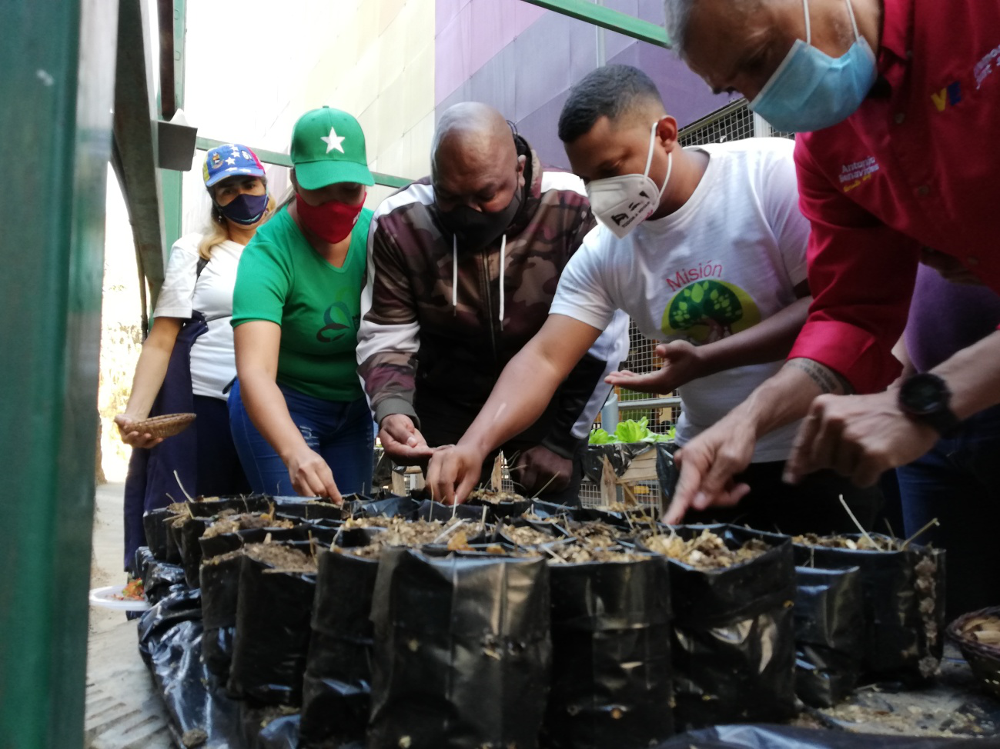

Desde la Gran Base Misiones, ubicada en la parroquia El Valle, de la ciudad de Caracas,  se realizó el lanzamiento del  Vértice Ecosocialista del  Movimiento por la Paz y la Vida. 

La actividad contó con la participación de Alexander Vargas Gutiérrez; secretario de la comisión presidencial por la paz y la vida y Jefe del movimiento por la paz y la vida,  Antonio Benavides; diputado de la Asamblea Nacional, **Wilmer Vásquez; Presidente de  la Misión Árbol** , Emilio Feriozzi; Director General del movimiento asuntos para la paz,  Robert Martínez; Director del Viceministro  de atención integral por la paz ,  Lysmar Urrieta; Directora del movimiento por la paz y la vida de Caracas , y de Zulay Herrera; Coordinadora de GBP El Valle.[]

Esta alianza, tiene previsto la siembra de mil plantas frutales, ornamentales y medicinales, en las 38 bases de misiones que existen a nivel nacional, esto con el fin de cumplir  con lo establecido en el 5to Objetivo Histórico del Plan de la Patria, y garantizar bienestar al pueblo venezolano.

> “Con este enlace tan importante, estamos cumpliendo el lineamiento de preservarla Pachamama y preservar la vida, como un solo gobierno, siguiendo la orientación de nuestro presidente Nicolás Maduro Moros” declaró Vargas.

Asimismo, destacó la plantación de tres árboles en honor al presidente Hugo Chávez Frías “mañana cumplimos un año más de la pérdida física de nuestro líder revolucionario, el presidente Chávez, y nosotros hemos sembrado 3 Araguaney aquí como un legado de nuestro líder eterno” dijo.

# Brigadas Ecosocialistas

Por otra parte, se espera la conformación de más de mil  Brigadas Ecológicas en todo el territorio Nacional,  orientadas a  la realización de  jornadas productivas en las bases de misiones, jornadas de reciclajes y jornadas de reforestación máxima.

El presidente de la Fundación Misión Árbol señaló que: “Vamos a conformar Ecobrigadas a nivel nacional, para con ello hacer distintas acciones ecosocialistas, tenemos la meta de establecer un millón de árboles en todo el territorio nacional, para así garantizar más futuro y más vida a las próximas generaciones”.

Por su parte, Antonio Benavides felicitó la gran iniciativa que han tenido estos dos movimientos para hacer este primer arranque, “este es un gran comienzo, la primera alianza estratégica, seamos elementos multiplicador a todo el resto de la población”. Además, señaló que desde el parlamento nacional, va a impulsar todas las leyes necesarias para fortalecer la preservación del ambiente.

Finalmente, Benavides, propuso la creación de un programa de educación ambiental para formar a los niños, jóvenes, y adultos en referencia al ecosocialismo y la importancia de la siembra de un árbol. 

**Prensa Mision Árbol / Kleyris Ramírez**

