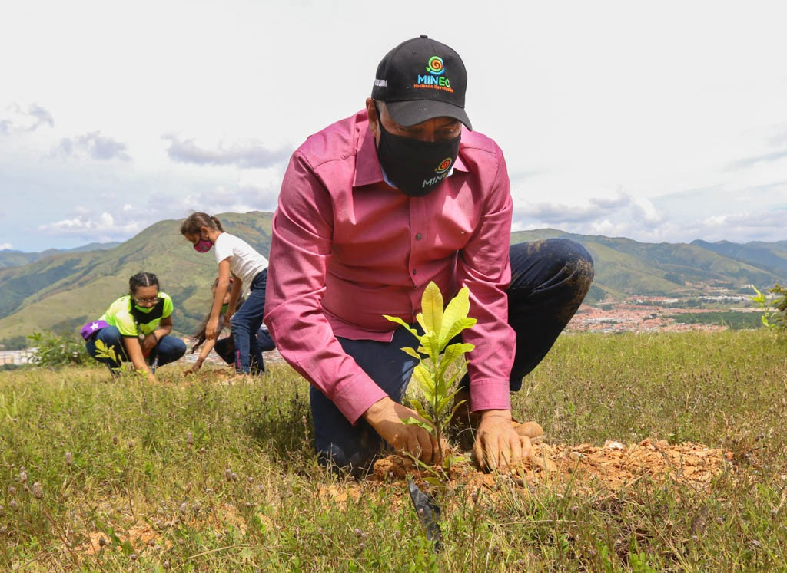

Lamentamos la partida física de nuestro Ministro Oswaldo Barbera, hombre trabajador y comprometido con el pueblo venezolano y la preservación del ambiente. Junto a usted sembramos vida y hoy nos toca sembrar su legado. Seguiremos #EnElCaminoCorrecto como siempre nos decía.

La noticia fue compartida en la cuenta oficial de la vicepresidenta @drodriven2 “Con profundo pesar informamos la partida física de nuestro querido Ministro para el Ecosocialismo. Oswaldo Barbera, hombre humilde, trabajador y honesto, de relación poética con la madre tierra transita a otro paisaje, de los que sembró y cultivó siempre con profunda humanidad”, refirió la vicepresidenta Rodríguez.

<blockquote class="twitter-tweet">
Con profundo pesar informamos la partida física de nuestro querido Ministro para el Ecosocialismo. Oswaldo Barbera, hombre humilde, trabajador y honesto, de relación poética con la madre tierra transita a otro paisaje, de los que sembró y cultivó siempre con profunda humanidad! <a href="https://t.co/hmajq1BLnj">pic.twitter.com/hmajq1BLnj</a>
&mdash; Delcy Rodríguez (@drodriven2) <a href="https://twitter.com/drodriven2/status/1382818968860246016?ref_src=twsrc%5Etfw">April 15, 2021</a></blockquote> 

## Filven

Nuestro ministro Oswaldo Barbera participó en el año 2020 en la Feria Internacional del Libro de Venezuela, allí presento su trabajo bibliográfico “Río abajo, balsero de mi alma” una serie de versos que revelan los misterios que tejen un mismo camino: el amor como deseo y transmutación en el otro.

Aquí presentamos el libro “Río abajo, balsero de mi alma” por Oswaldo Barbera.

<object data="https://ultimasnoticias.com.ve/wp-content/uploads/2021/04/Ri%CC%81o-abajo-balsero.pdf" type="application/pdf" width="700px" height="700px">
    <embed src="https://ultimasnoticias.com.ve/wp-content/uploads/2021/04/ri%cc%81o-abajo-balsero.pdf">
        
El navegador no soporta PDFs. Por favor descargar PDF: <a href="https://ultimasnoticias.com.ve/wp-content/uploads/2021/04/Ri%CC%81o-abajo-balsero.pdf">Descargar PDF</a>.

    </embed>
</object>

