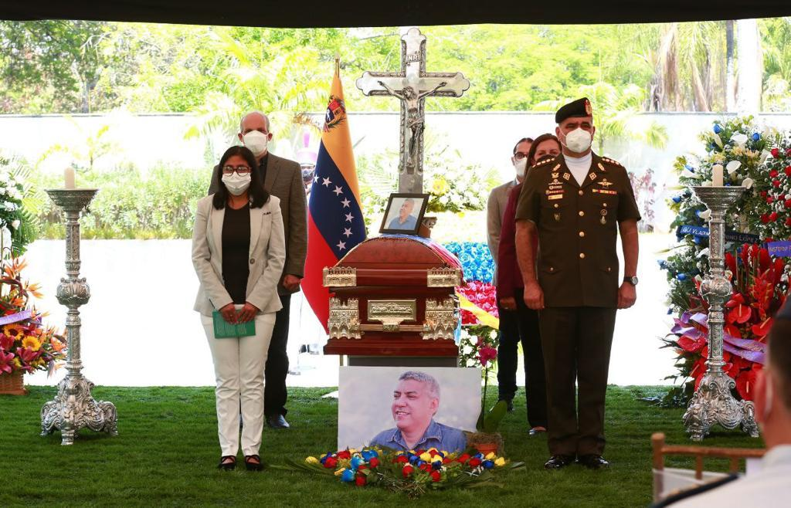

Desde las instalaciones del Parque Generalísimo Francisco de Miranda, específicamente en la Capilla Ardiente en Caracas, se llevó a cabo un homenaje en memoria del ministro para el Poder Popular para Ecosocialismo Oswaldo Barbera

La actividad fue presidida por la vicepresidenta Ejecutiva de la República Bolivariana de Venezuela, Delcy Rodríguez, acompañada por el ministro del Poder Popular para la Defensa, Vladímir Padrino López; el vicepresidente de Comunicación, Cultura y Turismo, Freddy Ñáñez; la ministra del Poder Popular para Relaciones Interiores, Justicia y Paz A/J Carmen Meléndez y el vicepresidente de Planificación, Ricardo Menéndez, así como amigos y allegados quienes rindieron honores al ministro.

Barbera, un hombre trabajador y comprometido con el pueblo venezolano, quien desde su designación el 12 de agosto del año 2019 por el presidente de la República, Nicolás Maduro Moros, dedicó su vida a la preservación del ambiente como parte del cumplimiento del 5to Objetivo Histórico del Plan de la Patria.

Cabe destacar que el titular de Minec ocupó el cargo de director regional en el estado Portuguesa del suprimido Ministerio del Ambiente, durante el año 2013. Recientemente, fue viceministro encargado para el Desarrollo Agrario y Gestión de Tierras del Ministerio para Agricultura Productiva y Tierras, además de presidir el ente adscrito Instituto Nacional de Desarrollo Rural (Inder).  

**Prensa Misión Árbol.**
