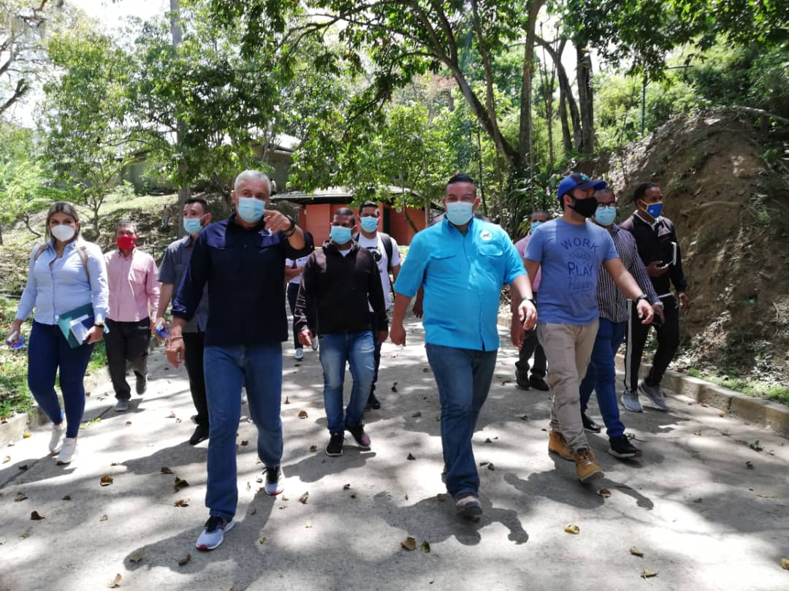

La Misión Árbol desarrolló jornada de limpieza, desinfección y embellecimiento del Parque Recreativo Nacional Zoológico de Caricuao, en Caracas.

La jornada contó con la participación del Ministro del Poder Popular para el Turismo Alí Padrón; el presidente de la Fundación Misión Árbol Wilmer Vásquez, el presidente del Instituto Nacional de Parques (Inparques) Josué Lorca el presidente de Corpotur Luis Eduardo Rodríguez, Protección Civil y la Alcaldía de Caracas.

Durante la actividad se logró la desinfección de los espacios comunes con hipoclorito de calcio, y el embellecimiento de las distintas áreas del parque.

Con esta jornada se cumplen 6 millones 482 mil 926 labores de desinfección en toda Venezuela, el ministro de turismo expresó que: “Esta es la jornada número 54, en la cual hemos abordado 1 millón 409 mil 990 espacios y han participado de
manera activa 23 mil 230 trabajadores”.  

Asimismo Misión Venezuela bella resalto la importancia de la participación activa entre gobierno y poder popular, en las labores de limpieza, desinfección y embellecimiento de Venezuela, “el país más bello del mundo”.

Por su parte, el presidente de Inparque agradeció al mandatario venezolano, Nicolás Maduro por los avance en las jornadas de limpieza y desinfección e informó que dicho parque está inscrito dentro del nuevo Plan Caracas Patriota, Bella y Segura, el cual garantizará labores de remodelación y restauración de todo el sistema de riego del parque recreativo.

Finalmente, Lorca invitó a la población venezolana a disfrutar de este hermoso parque nacional, durante la semana de flexibilización tomando todas las medidas de bioseguridad.

**Prensa Misión Árbol.**
