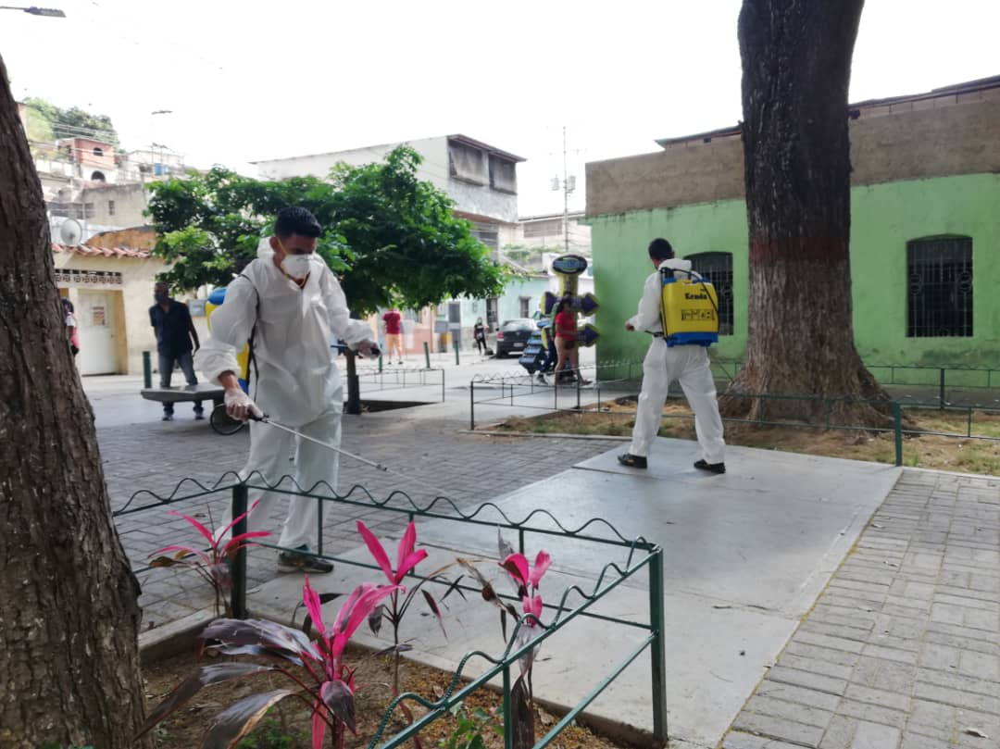

En el marco del Plan Bicentenario Carabobo el Ministerio del Poder Popular para el Ecosocialismo conjuntamente con la Misión Árbol, desarrollaron jornada de limpieza, desinfección y embellecimiento en la parroquia Antímano.

La actividad contó con la participación del Jefe de Gobierno del Distrito Capital, Nahum Fernández; el presidente de la Misión Árbol, Wilmer Vásquez, el Concejal de la parroquia Antímano, Jimmy Gudiño y miembros de las distintas organizaciones sociales del sector.

Durante la actividad se logró la limpieza, desinfección, desmalezamiento y pintando de los espacios públicos. Además, se realizó la donación de materiales de limpieza como bolsas para la recolección de desechos, escobas y pinturas para las distintas áreas de la zona.

Wilmer Vásquez, presidente de la Misión Árbol manifestó que por orientaciones del presidente Nicolás Maduro y del Ministro del Poder Popular para el Ecosocialismo Josué Lorca se desempeñó el Plan Caracas Patriota Bella y Segura en la Plaza Bolívar de Antímano, “para que los caraqueños puedan celebrar el bicentenario como lo quiso nuestro libertador Simón Bolívar”.

Asimismo Vásquez expresó que continuarán desarrollando un plan de trabajo y atención a la parroquia, para garantizar el mantenimiento de los espacios dónde comúnmente pasa los habitantes de este sector.

El jefe de gobierno del Distrito Capital Nahum Fernández resaltó la importancia del acontecimiento histórico: “Éste es un trabajo en conjunto, necesitamos que Caracas esté bella el 29 de junio para que tengamos la llegada triunfante de nuestro libertador desde Carabobo, todo el mundo tiene que estar sumido dentro del tema histórico de los 200 años”.

Por su parte el Concejal de la parroquia Jimmy Gudiño, mostró su gratitud a la institución por la labor desempeñada, e invitó a la comunidad a unir fuerzas para lograr los objetivos como un pueblo organizado, “agradecemos al Ministerio de Ecosocialismo específicamente al presidente de la Misión Árbol Wilmer Vázquez por el arduo trabajo y esfuerzo para garantizar el mejoramiento de los espacios públicos de nuestra parroquia en esta era Bicentenaria” dijo.

**Prensa Misión Árbol/ Kleyris Ramírez**

