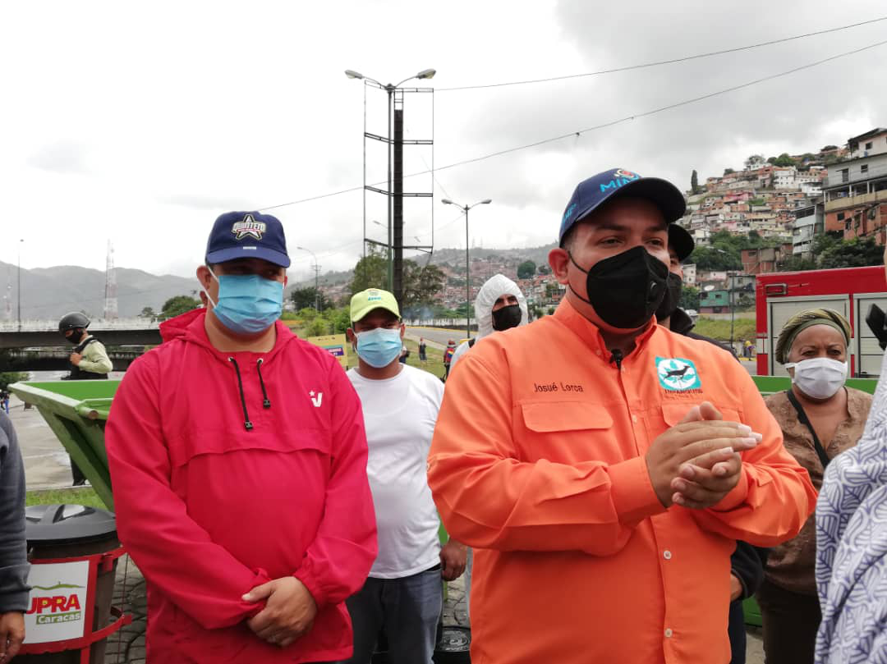

En el marco del Plan Caracas Patriota Bella y Segura que ha venido desplegándose en todas las parroquias de la capital, el Ministerio del Poder Popular para el Ecosocialismo conjuntamente con la Fundación “Misión Árbol” desarrollaron una jornada de limpieza, desinfección y embellecimiento en la parroquia Antímano.

La actividad contó con la participación del Ministro del Poder Popular para el Ecosocialismo, Josué Lorca.El presidente de la Misión Árbol, Wilmer Vásquez. El Concejal de la parroquia Antímano, Jimmy Gudiño, y con el apoyo de la Alcaldía de Caracas, Supra Caracas, Inparques, los Bomberos Forestales, el PSUV, la JPSUV, la Policía Nacional Bolivariana  y  miembros de las distintas organizaciones sociales del sector.

Durante la actividad se logró la limpieza, desinfección, desmalezamiento y pintando de los espacios públicos. 

El Ministro de Ecosocialismo, informó que se está trabajando conjuntamente con el Poder Popular Organizado,  y se tiene previsto la celebración del aniversario número cuatrocientos (400) de la parroquia Antímano.

Finalmente, el ministro Lorca, aprovechó la oportunidad para reiterar el llamado a cumplir las normativas de bioseguridad ante la amenaza del Covid-19, “vamos a seguir cumpliendo los protocolos de sanidad, el distanciamiento social y el 7x7, respetemos las normas y recordemos que cuidándonos cuidamos a los demás”.

**Prensa Misión Árbol/ Kleyris Ramírez**

