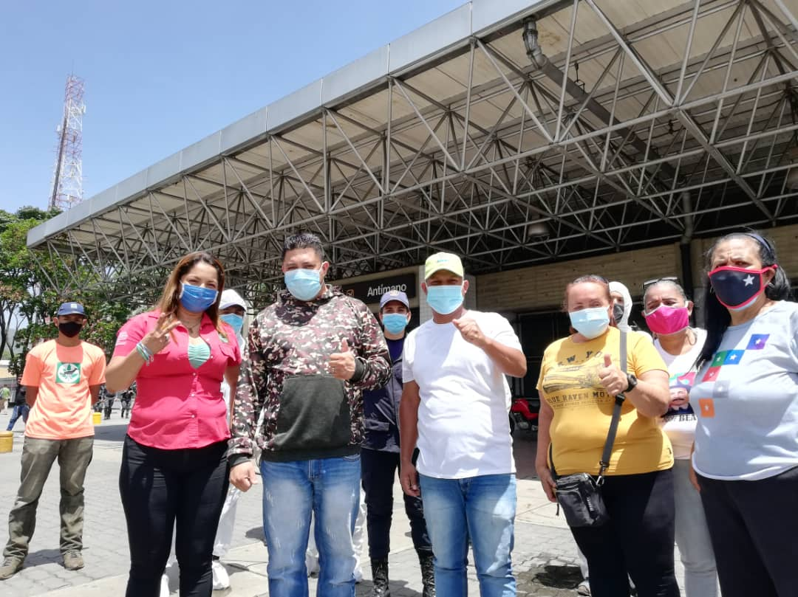

En el Marco del Plan Caracas Patriota, Bella y Segura el Ministerio del Poder Popular para el Ecosocialismo y la Misión Árbol desarrollaron la jornada número 56 de Venezuela Bella en la parroquia Antímano, específicamente en la estación del Metro

La actividad contó con la participación del Presidente de la Misión Árbol, Wilmer Vásquez; el Coordinador del PSUV de la parroquia Antímano, Jimmy Gudiño; la responsable de la parroquia Antímano, Janeth Andrade y miembros de las distintas organizaciones sociales del sector, y con el apoyo de Inparques y los Bomberos Forestales.

Wilmer Vásquez, presidente de la Misión Árbol señaló que siguiendo los lineamientos del presidente Nicolás Maduro y el Ministro del Poder Popular para el Ecosocialismo Josué Lorca, durante la actividad se logró la limpieza, desinfección, desmalezamiento y pintado de brocales, con la finalidad de “celebrar el Bicentenario con alegría, emoción y entusiasmo”.

Jimmy Gudiño, Coordinador del PSUV de la parroquia Antímano manifestó su agradecimiento al Ministro de Ecosocialismo y al presidente de la República por las labores desempeñadas en la parroquia, asimismo expresó que: “Seguiremos trabajando de la mano para resolver los problemas que se susciten en la parroquia, y para embellecer la Ciudad Capital cuna del Libertador Simón Bolívar, en esta era Bicentenaria”.

**Prensa Misión Árbol/ Kleyris Ramírez**

