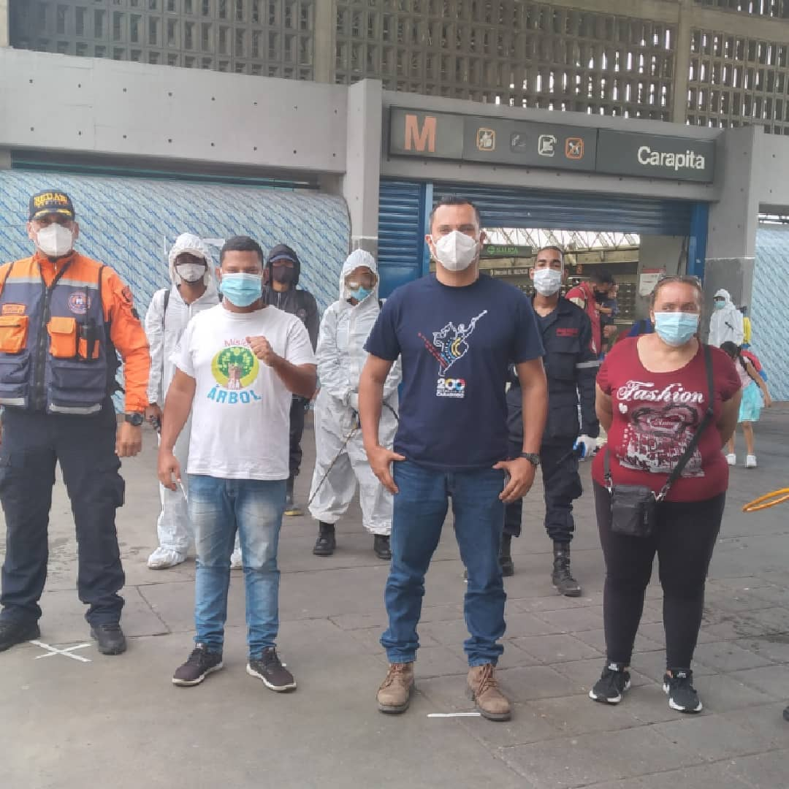

En el Marco del Plan Caracas Patriota, Bella y Segura el Ministerio del Poder Popular para el Ecosocialismo y la Misión Árbol desarrollaron la jornada número 58 de Venezuela Bella en la parroquia Antímano, específicamente en la estación Carapita del Metro de Caracas este miercoles 19-M.

La actividad contó con la participación del Presidente de la Misión Árbol, Wilmer Vásquez; el Gerente General de la Corporación Socialista de Cemento, Oscar Scola; la responsable de la parroquia Antímano, Janeth Andrade, y con el apoyo de Inparques, los Bomberos Forestales, Supra Caracas, y el Poder Popular.

Wilmer Vásquez, presidente de la Misión Árbol señaló que siguiendo los lineamientos del presidente Nicolás Maduro y el Ministro del Poder Popular para el Ecosocialismo Josué Lorca, durante la actividad se logró la limpieza, desinfección, desmalezamiento y pintado de los espacios de la estación del Metro, con la finalidad de “garantizar que la parroquia Antímano esté más hermosa, segura y con mayores condiciones para el bienestar de nuestro pueblo”.

**Prensa Misión Árbol/ Kleyris Ramírez**

