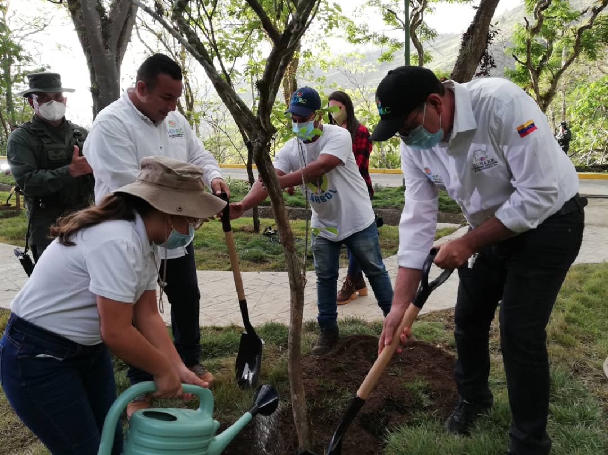

En el marco del Día del Araguaney y Día Nacional del Árbol el Ministro del Poder Popular para el Ecosocialismo, Josué Lorca, inauguró un Jardín Bicentenario en las instalaciones del Parque Nacional Vinicio Adames, ubicado en el estado Miranda.

La actividad contó con la participación del Ministro del Poder Popular para el Ecosocialismo, Josué Lorca; El Ministro del Poder Popular para la Educación Universitaria, César Trompiz; La Ministra del Poder Popular para las Comunas y Protección Social, Noris Herrera; el Presidente de la Misión Árbol Wilmer Vásquez, y con el apoyo de Inparques, Conare, la Guardería Ambiental, los Bomberos Forestales, miembros del sector universitario, el Poder Popular y la Juventud del Partido Socialista Unido de Venezuela (JPSUV).

Durante la jornada el ministro Lorca destacó que la Misión Árbol en 15 años de gestión, ha sembrado 31 millones de árboles y ha reforestado 28 mil hectáreas degradas por incendios forestales en todo el país “la meta de este año, es de 5 millones de plantas, así como la conformación de 3 mil Consejos Ecosocialistas y más de 300 Comités Ecosocialistas”, señaló.

Asimismo, explicó que en todo el país se realizó la inauguración de Jardines Bicentenarios, donde resaltó la labor y el compromiso del sector universitario, el Poder Popular y la Juventud del Partido Socialista Unido de Venezuela por el esfuerzo en el cumplimiento de esta tarea. 

Finalmente, Lorca realizó la siembra del Árbol Nacional “El Araguaney y del Árbol representativo de nuestra ciudad “La Ceiba”, e hizo un llamado a seguir reforestando, cuidando y protegiendo el ambiente para así garantizar el cumplimiento del quinto objetivo histórico del Plan de la Patria.

**Prensa Misión Árbol/ Kleyris Ramírez**

