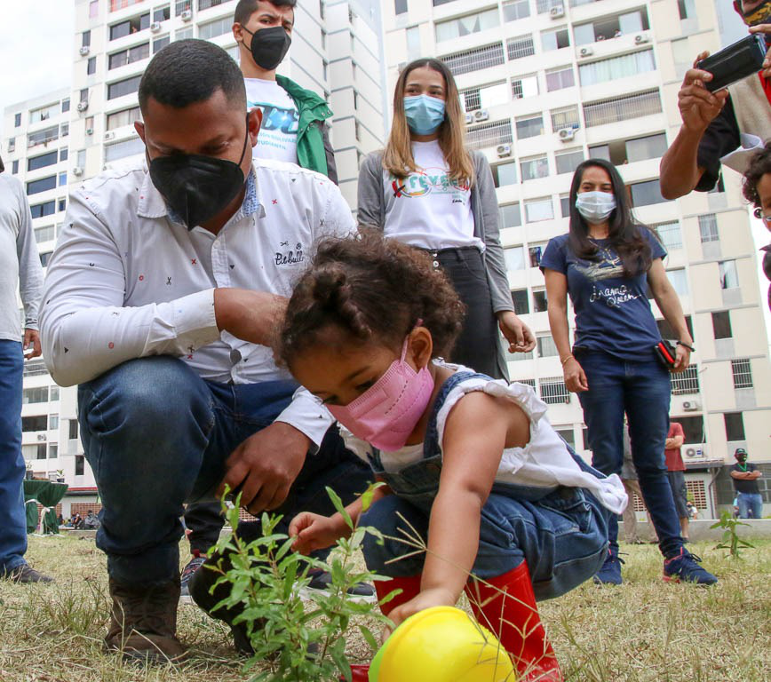

En el marco de la celebración Aniversario Nº15 la Misión Árbol se desarrolló  gran Jornada Nacional de Plantación de Árboles Frutales y Forestales en los urbanismos de la Gran Misión Vivienda Venezuela (GMVV).

La actividad central tuvo lugar en la comunidad Ciudad Tiuna específicamente en el urbanismo Ezequiel Zamora, donde se estableció un bosque frutal en compañía de los niños, jóvenes y adultos de la comunidad.

Vásquez expresó su agradecimiento y felicitaciones a todo el equipo desplegado a lo largo del territorio nacional  e hizo un llamado a continuar el trabajo que se ha venido desarrollando “sigamos con fuerza  reforestando la patria, promoviendo la recuperar de los bosques y la creación de una conciencia colectiva ecológica, para saldar la deuda histórica que la población tiene con la madre tierra”.

En la actividad participaron: Luis Palacio  (viceministro de Gestión Integral de la Basura), Fernando Rodríguez (viceministro de Comunas), Yohana Carrillo (viceministra de Redes Populares en Vivienda), Jorge Pérez (viceministro de Comunidades Educativas y Unión con el Pueblo), David Graterol (diputado PSUV) y la Autoridad Única de Ciudad Tiuna.

**Prensa Misión Árbol/ Kleyris Ramírez**

