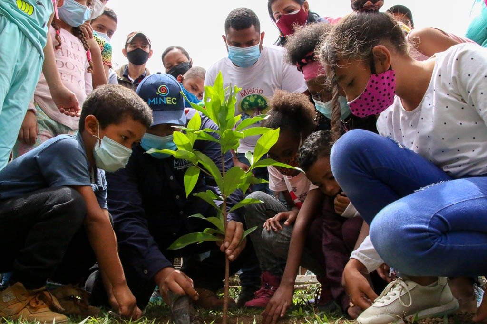
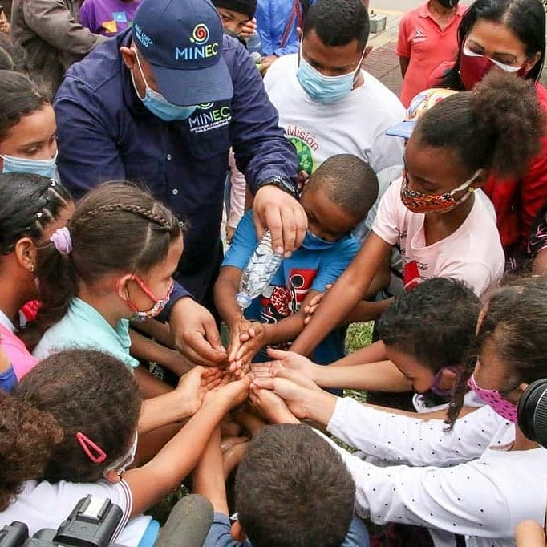
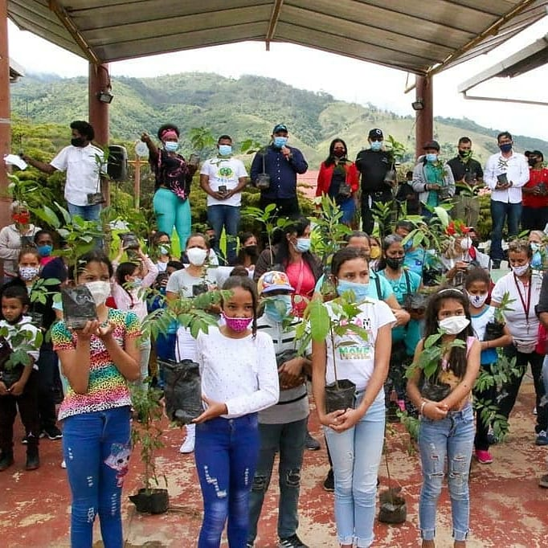

Misión Árbol en conjunto con el Ministerio del Poder Popular para el Ecosocialismo llevo a cabo la Gran Jornada Nacional un (1) Árbol por calle, la cual tuvo lugar en la Parroquia sucre específicamente en el Núcleo de Desarrollo Endógeno “Fabricio Ojeda”.

La apertura de la actividad estuvo a cargo del ministro de Ecosocialismo José Lorca, con la siembra simbólica donde expreso “estamos aquí cumpliendo con las acciones del marco Bicentenario de la Batalla de Carabobo como lo indico nuestro presidente Nicolás Maduro, con este acto significativo en el eje 7 de Gramoven, hacemos entrega de un árbol a cada presente para garantizar la vida y celebrar el renacimiento de la patria.” De igual manera Lorca mostro su júbilo por compartir con cada niño y cada miembro de esta comunidad.

En representación de la Misión Árbol el Director de la Wilmer Vázquez mostro su contento y entusiasmo de compartir con los niños y la comunidad del Endógeno, de igual manera le expreso a todo los presente la importancia de un árbol en cada calle del país 

>“ los árboles son símbolos de esperanza y amor el cual debemos inspirarle a nuestros niños para un futuro mejor , de igual manera imaginemos dentro de unos años cada uno de estos árboles dándonos frutos y sombra en nuestras comunidades, esa será nuestra mayor satisfacción “.

Seguido a la siembra simbólica, los asistente y a autoridades entonaron el Himno Nacional y Himno del Árbol, luego los niños de dicha comunidad recitaron un poema dedicado al árbol y de igual manera los jefe de calle y encargados de la comunidad expresaron sus agradecimiento con palabras muy emotivas.

Para cerrar se procedió a la juramentación donde todos los presentes se comprometieron a sembrar y cuidar cada una de esas plantas, para que en el futuro den frutos y sombra a cada persona, y sobretodo inculcar en cada niño el amor por los árboles y plantas para cosechar mas vida y cumplir con el legado de nuestro Comandante Chávez.

**Prensa Misión Árbol/ Kleyris Ramírez**

