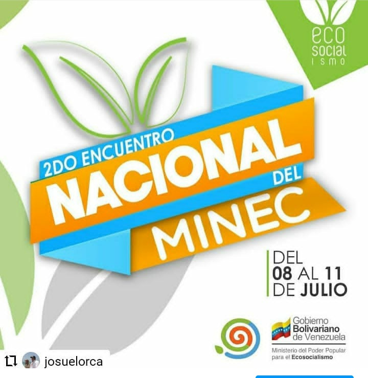
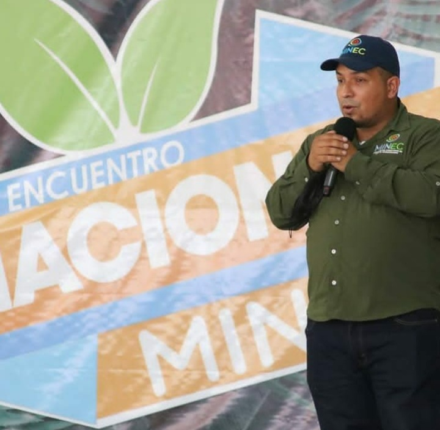
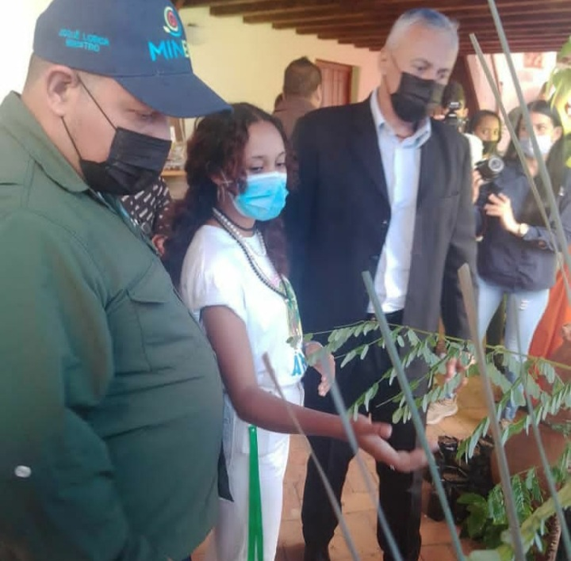
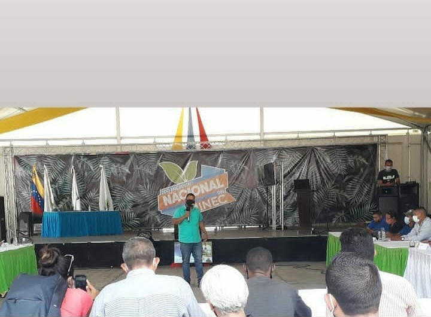

El pasado fin de semana se llevó a cabo el 2do Encuentro Nacional del Ministerio del Poder Popular para el Ecosocialismo, el cuál conto con la participacion demás de 200 personas de las direcciones regionales, equipos de gestión Ecosocialista y entes adscritos de la institución.

Actividad que tuvo lugar en PDVSA la Estancia en la ciudad de Caracas, comenzó desde el día viernes con unas Palabras por parte de nuestro Ministro de Ecosocialismo Josué Lorca. “Estamos debatiendo el destino de la Patria para la construcción del Ecosocialismo, como modelo de vida para la especie Humana en armonía con el Ambiente” Expresó

El encuentro contó con la presencia del Ministro del Poder Popular para la Ciencia y Tecnología César Trompiz, Ministro del Poder Popular para el Turismo Alí Padrón, Viceministro para el Ecosocialismo Luis Palacio y la Viceministra para las Nuevas Fuentes Tania Masea.

El día sábado el Presidente de la Misión Árbol Lic. Wilmer Vasquez presentó su plan en este 2do Encuentro en el cual brindó importantes anuncios para el fortalecimiento de la Misión en todo el territorio Nacional, “siguiendo instrucciones de nuestro Presidente Nicolás Maduro, damos inicio a las políticas para relanzar la Misión y mostrar la producción realizada en cada uno de los Estados”. En este sentido, dio a conocer los nuevos vértices de acción para caminar de la mano con los venezolanos como lo dijo el Comandante Eterno "Hugo Chávez &quot", y de esta manera cumplir con el 5to objetivo Histórico del Plan de la Patria.

Entre música y actividades recreativas que formaron parte de este encuentro, transcurrieron tres días de aprendizaje y enseñanza que proporcionó esta reunión, culminado el día domingo con un paseo a nuestro parque Nacional Waraira Repano encabezado por el Ministro Josué Lorca, realizando una hermosa caminata hasta el sector Lagunazo, donde todo el sector Ecosocialista de Venezuela expreso estar unidos y comprometidos con el país y así poder cumplir con el 5to objetivo del Plan de la Patria en conjunto con el Presidente Nicolás Maduro.

**Prensa Ecosocialismo (Misión Árbol)**

