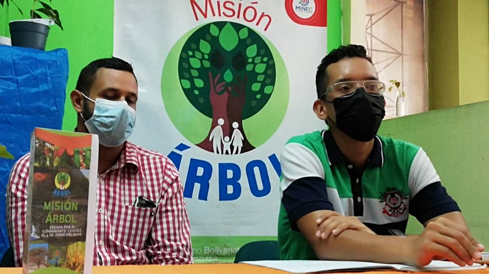
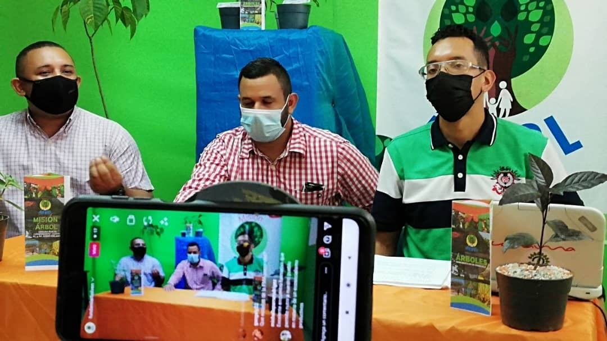
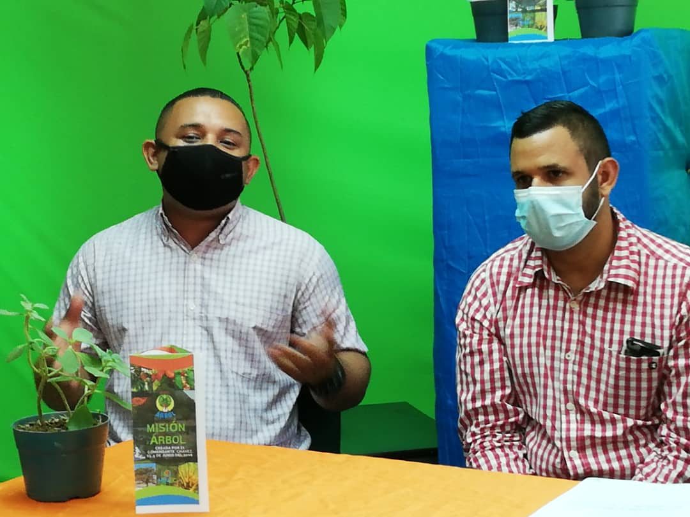

Este lunes 26 de julio Misión Árbol realizó su 1er En vivo por la plataforma de Instagram cumpliendo con el cronograma de los “Martes Formativos”, impulsado por la Dirección Nacional de formación donde el tema que desarrollamos fue “Bioinsumos, Potencialidades y Desafíos”.

La cita tuvo lugar en la sede de la fundación ubicada en Caracas y contó con la participación de los ponentes : Dr. Argenis Flores , Ing. Arnaldo Vegas, Lic. Gerard Molina y la Dirección de la Misión Árbol Distrito capital , es importante señalar que los ponentes son Directores nacionales que cumplen con una ardua labor en las distintas áreas en las que se desempeñan.

El objetivo de estas transmisiones es dar a conocer algunos datos que pueden ser de utilidad para seguir impulsando nuestros Viveros comunitarios y garantizar la soberanía productiva.

Por su parte, la utilización de herramientas digitales como las redes sociales, nos permiten llegar a un mayor número de personas por lo tanto el canal en esta oportunidad fue el Instagram Live.

¡Gracias a todos los que Participaron !

