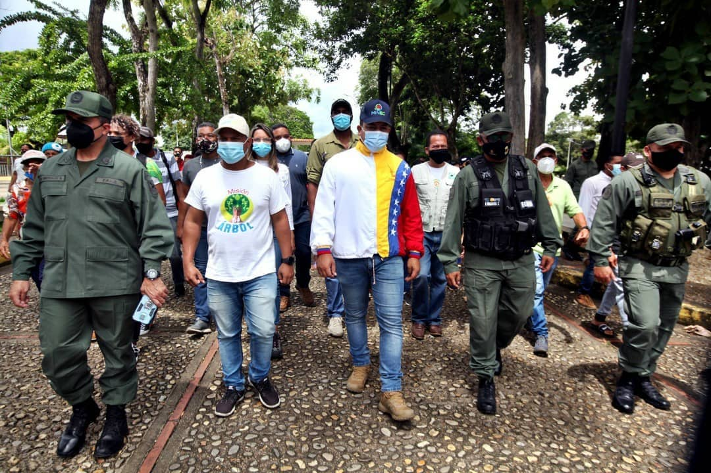
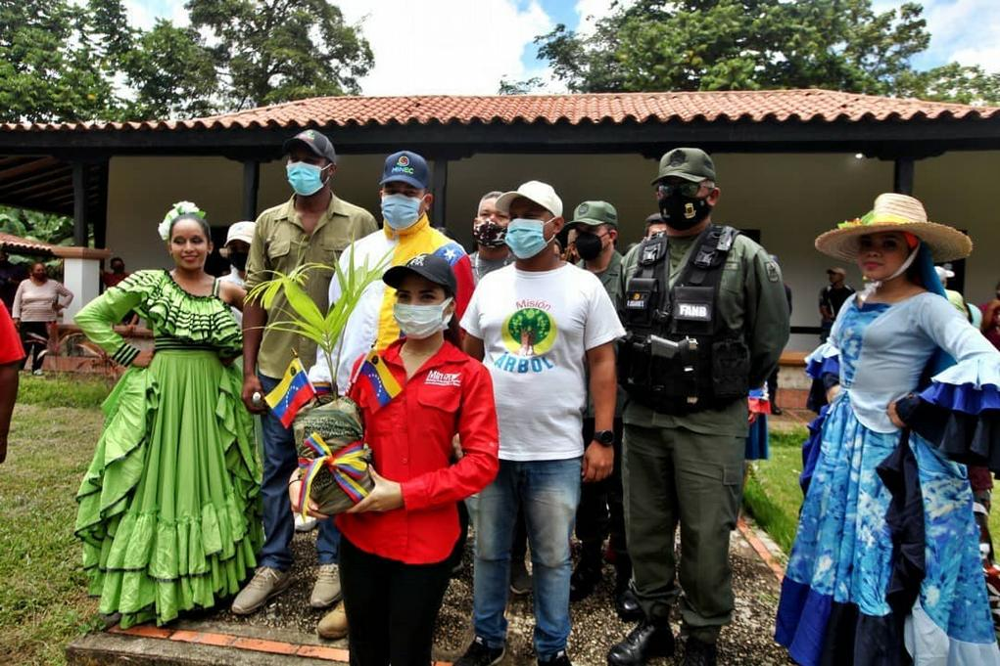

En convenio con el Consejo Comunal Brisas de Sarrapial de la Parroquia Boquerón, del Municipio Maturín, y el Ministerio del Poder Popular para el Ecosocialismo (Minec), a través de la Misión Árbol, instalaron el primer vivero comunitario en el estado Monagas.

El presidente de la Misión Árbol, Wilmer Vásquez, visitó este sábado 21 de agosto a la entidad oriental para concretar la firma del convenio, que además establece la reforestación de los espacios comunitarios.

Vásquez señaló que con la instalación de este vivero se producirán 12 mil plantas frutales, medicinales, ornamentales y hortícolas en un primer ciclo, y 24 mil para el segundo ciclo en el transcurso de un año.

El presidente de la Misión Árbol indicó que “en el marco de una jornada de amor y atención a las víctimas del bloqueo económico, se desarrolla en Monagas este proyecto, para seguir construyendo un mundo de igualdades y de bienestar para el pueblo”.

Destacó que los protagonistas de este proyecto son las 203 familias que integran este sector, quienes tendrán la tarea de producir y reforestar los espacios naturales de esta comunidad, en contribución de combatir el cambio climático para la preservación del planeta Tierra.

A su vez, Heberto Solarte, director regional del Minec, dijo que este consejo comunal ha demostrado un amplio compromiso con el rescate y  la preservación de los espacios naturales en su comunidad, por ello fueron seleccionados para ser partícipes de este primer vivero en la entidad.

Así mismo, Magalis Barreto, integrante del consejo comunal, agradeció la oportunidad que se le brinda en este momento donde se requiere un mayor compromiso al ser garantes de espacios para el bienestar, no solo de la comunidad, sino del pueblo venezolano en general.

