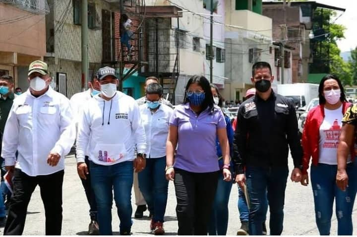
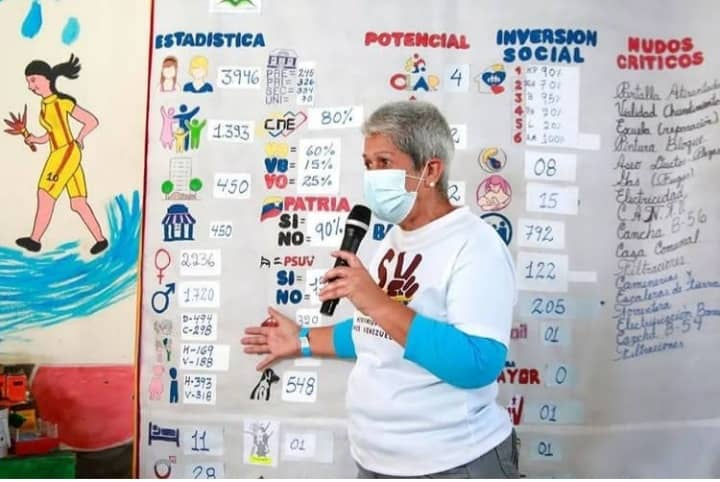
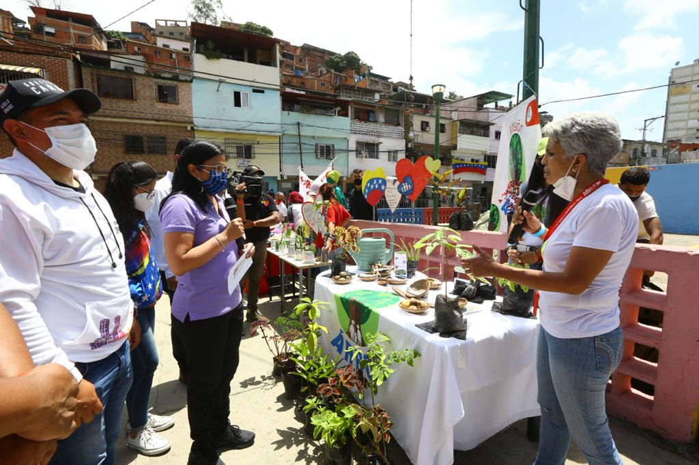

El ministro del Poder Popular para el Ecosocialismo  (MINEC) realizo  la entrega de árboles frutales y plantas ornamentales a la Base de Misiones "Sueño de Hugo Chávez" ubicado en la Parroquia 23 de Enero en Caracas,  con el fin de atender a las víctimas del Bloqueo Económico. 

En compañía  de la Vicepresidenta Ejecutiva Delcy  Rodríguez,  conversamos con los líderes comunitarios, quienes compartieron los resultados de la Atención Social  que se brindan a través de las Bases de Misiones. Resaltando que el gobierno Bolivariano está desplegado en dichas bases a nivel nacional, para ofrecer atención directa a las familias más vulnerables que sufren los efectos del bloqueo criminal contra nuestro País.

En la actividad se contó con atención médica donde se realizó la entrega de medicamentos para cuidar y priorizar la salud de los miembros de la comunidad, seguido a esto se realizo un recorrido por diferentes stands, que presentaron diversos  movimientos de la patria, como la Misión Árbol, el movimiento Somos Venezuela, la Gran Misión Barrio Tricolor, el Ministerio del Poder Popular para  el  Comercio Nacional y entre otros.

 A su vez se abordó el tema de la importancia que tiene la Cartografía Social, siendo este el que ofrece la solución a los problemas  de mayor prioridad en las Comunidades, convirtiéndose en el elemento fundamental para el Poder Popular.l objetivo de estas transmisiones es dar a conocer algunos datos que pueden ser de utilidad para seguir impulsando nuestros Viveros comunitarios y garantizar la soberanía productiva.

Este tipo de actividades se están desplegando a nivel nacional  con el objetivo de impulsar las políticas de protección social y garantizar la máxima seguridad y bienestar de las familias Venezolanas.

