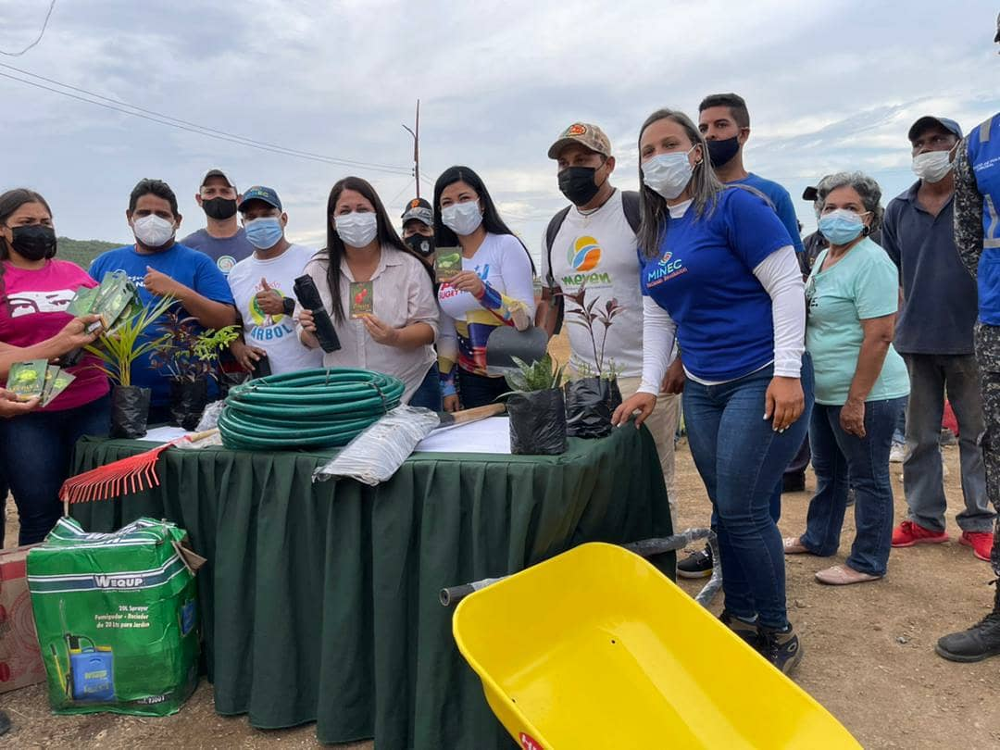
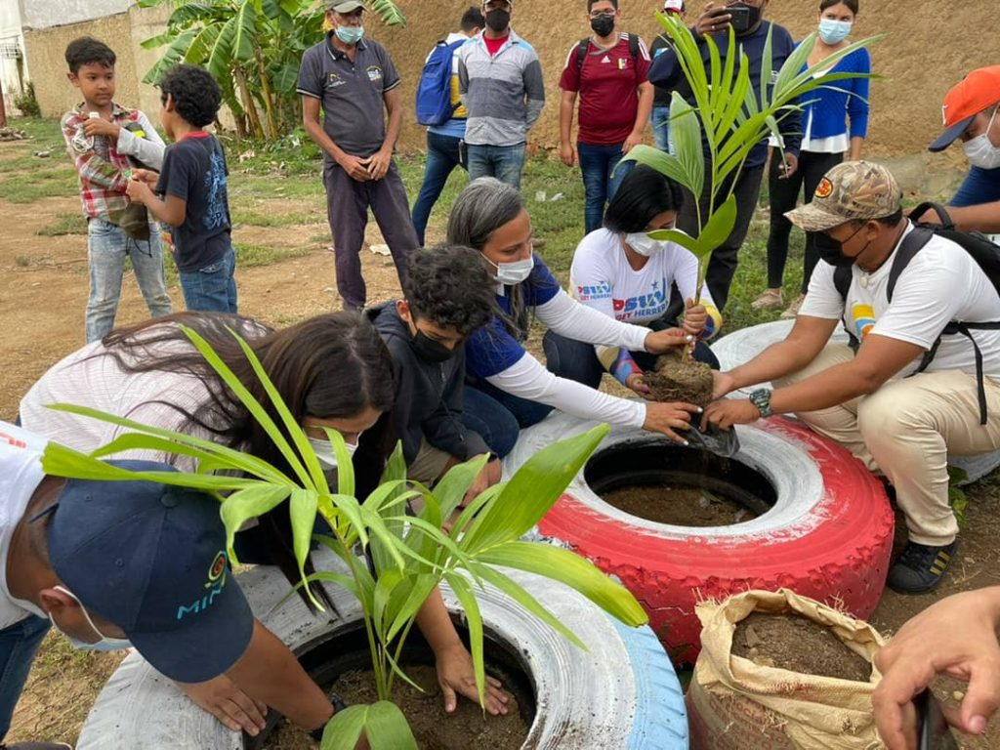

Con el objetivo de seguir en la promoción de la producción nacional y los valores ambientales en todos los ámbitos, este viernes fue inaugurado el primer vivero comunitario en el estado Anzoátegui, en la Comuna Luisa Cáceres de Arismendi, ubicada en la ciudad de Barcelona.

El acto de lanzamiento contó con la participación del presidente de la Misión Árbol, Wilmer Vásquez,  el director Nacional de las Unidades Territoriales para el Ecosocialismo (Utec), César Solis, el Director general de Aprovechamiento de la Basura, José García, la alcaldesa de Barcelona, Anyer Henríquez, la candidata a la Alcaldía, Sugey Herrera, los voceros de las estructuras del Poder Popular organizado y los directores regionales del Equipo de Gestión Ecosocialista.

Solis, en representación del Minec Nivel Central, declaró que esta inauguración es un ejemplo más del compromiso que tiene el Gobierno Bolivariano con el impulso de las acciones productivas desde las comunas.

> "Sí podemos ser productivos y podemos hacerlo en equilibrio con nuestros entornos, generando bienestar a la comunidad al trabajar en equilibrio con la naturaleza”

afirmó el funcionario, quien añadió que este vivero tendrá la tarea de producir dos mil plantas frutales, ornamentales y medicinales, que estarán a disposición de la comuna.

Por su parte, el presidente de la Misión Árbol, Wilmer Vásquez, recordó que cada ejemplar que se establezca en el territorio de la comuna, será uno más de los millones que se deben establecer en el mundo para mitigar los efectos del cambio climático.

> "Establecer plantas, es una tarea que todos los ciudadanos del mundo deberíamos hacer por práctica y convicción, para así poder salvar al planeta y a todos los organismos vivos que lo habitan de los efectos que ya se están manifestando en el clima, como el incremento de las temperaturas o las lluvias torrenciales”. Sostuvo Vásquez.

Durante su intervención Rosa Cáceres, vocera de la Comuna, dijo que el vivero rendirá honores al luchador social recientemente fallecido, Pablo Characo, por su compromiso al ser fiel defensor de la semilla autóctona.

