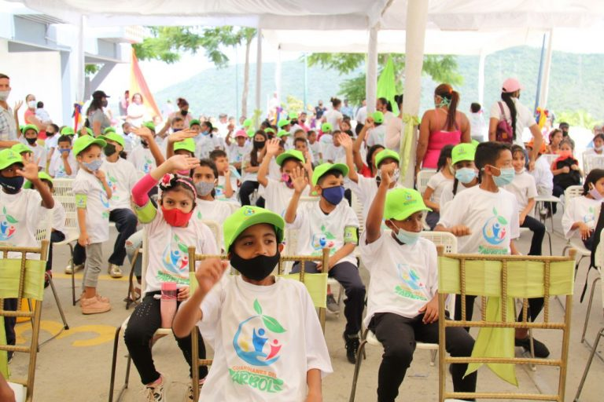
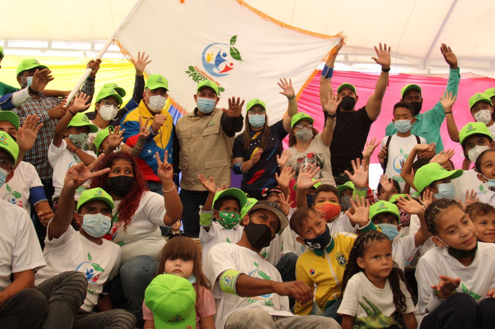

Este jueves, comenzó en Ciudad Caribia el Plan Nacional Guardianes del Árbol, con el lema “Salvando la Vida en el Planeta”, un proyecto impulsado por la Fundación Misión Árbol, ente adscrito al Ministerio del Poder Popular para el Ecosocialismo (Minec).

La iniciativa tiene como objetivo formar y preparar a niños desde los tres años hasta personas de la tercera edad, en aspecto del cuidado y la preservación de las especies vegetales, además fomentar la necesaria protección de la naturaleza.

El plan se desplegará en todo el país y los participantes estarán agrupados en brigadas de acuerdo con las edades, con los nombres de Araguaney, Jacaranda, Flamboyán, Bucare y Mango.

En el acto de lanzamiento estuvo el titular del Minec, Josué Lorca, la viceministra de Juventud y Deporte, Jesica Bello, el viceministro de la Suprema Felicidad Social, presidente de la Misión Negra Hipólita y Autoridad Única del Distrito Motor Ciudad Caribia, V/A Luis José Pestana Abreu, y la presidenta de la Misión Nevado, Maigualida Vargas, entre otras autoridades.

En Ciudad Caribia, los Guardianes del Árbol tendrán más de 300 niñas y niños organizados, fundadores del proyecto, que integrarán las diferentes brigadas. En el país cuentan con 1.673 infantes.

El ministro Lorca expresó en su intervención que con los Guardianes del Árbol se pretende abarcar un total de 2.500 personas en el territorio nacional, integrados como brigadistas y de esa manera dar cumplimiento con el Quinto Objetivo Histórico del Plan de la Patria: preservar la vida en el planeta y salvación de la especie humana.

“Es un movimiento instruido por nuestro presidente Nicolás Maduro Moros, para sumar todas aquellas voluntades desde niños, adolescentes, jóvenes, adultos y adultos mayores, a proteger la Pachamama, a proteger la naturaleza”, dijo Lorca.

Por su parte, la viceministra Bello, felicitó a todos los que hicieron posible el plan y manifestó que se debe trabajar de manera mancomunada “para fortalecer este tipo de actividades que integran a niños, niñas y adolescentes, a ejercer una labor única e independiente de cuidar la madre naturaleza”.

La Autoridad Única del Distrito Motor Ciudad Caribia, de Desarrollo, V/A Luis José Pestana Abreu, destacó que esta formación tuvo un proceso de 15 días, en los que se le inculcó a los niños y niñas, los valores humanistas del Ecosocialismo, a la espera de que cada uno con su granito de arena, y el aprendizaje obtenido, fortalezcan la flora y la fauna que hace vida en el complejo urbanístico de Ciudad Caribia.

“Invito a los asistentes a cuidar y conservar los espacios que se encuentran allí para el disfrute de toda la comunidad”, señaló Pestana Abreu.

Para finalizar, Lorca agradeció a los asistentes y a los que forman parte de Guardianes del Árbol, por ratificar su compromiso con la naturaleza y seguir las instrucciones del presidente Nicolás Maduro, en aras de fortalecer todos los ámbitos relacionados con la Madre Tierra.

**Prensa Ecosocialismo (Minec) / Mareska Piñango**

**Contacto / ecosocialismoprensa@gmail.com**