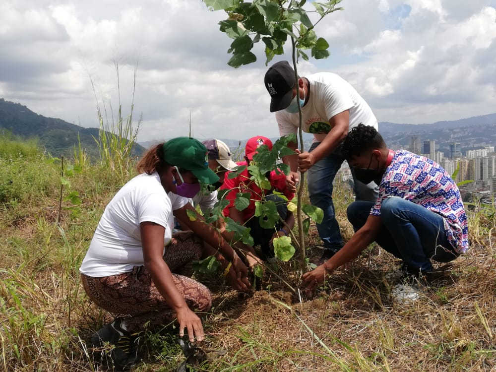
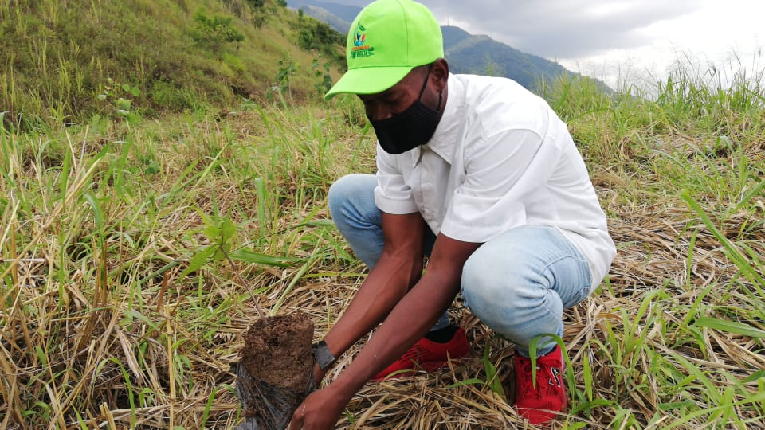
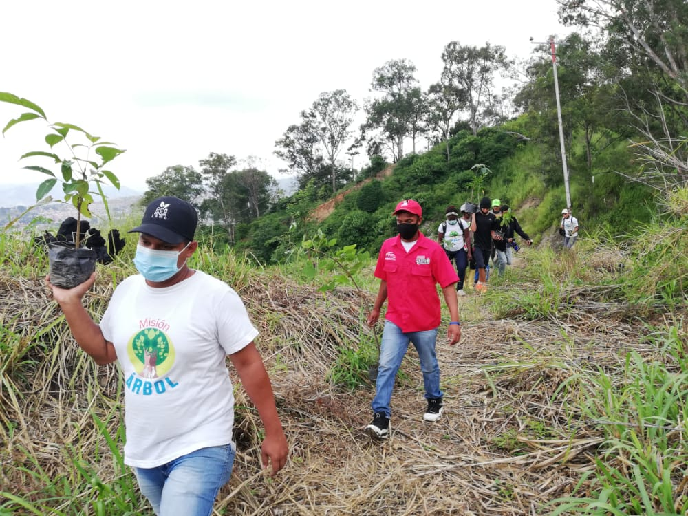

Con una acción simultánea en 20 estados del país, la juventud ecosocialista, ambientalistas y del Movimiento Jóvenes de la Patria Robert Serra, desarrollaron una reforestación para conmemorar los siete años de la partida física del joven mártir.

En el sector Catuche de la parroquia La Pastora, área en Caracas seleccionada para realizar la jornada, el presidente de la Fundación Misión Árbol, ente adscrito al Ministerio del Poder Popular para el Ecosocialismo (Minec), Wilmer Vásquez, lideró la plantación de 100 árboles forestales con la participación de decenas de jóvenes.

“Nos encontramos realizando una jornada nacional de reforestación para rememorar la lucha y esencia de nuestro hermano Robert Serra, para que con su ejemplo y espíritu pasionario, nos llene a los jóvenes del movimiento, la misión y los guardianes del árbol, de amor por la madre tierra”,
aseguró Vásquez.

Por su parte, Miled Rojas, directora de la Misión Árbol en Caracas, indicó que se colocaron árboles de tipo forestal correspondientes a las especies bucare y flamboyán, para repotenciar el bosque del Waraira Repano, una acción que se hizo a nombre del luchador que despertó el espíritu de juvenil de combate.

Asimismo, uno de los brigadistas fundadores del Movimiento Jóvenes de la Patria Robert Serra en Caracas, Wilson Maestre, señaló que su presencia en el operativo para restaurar la vegetación del pulmón de Caracas, es en conmemoración y honor al valiente joven combatiente.

“A Robert nos lo arrebataron y causó un dolor fuerte. Lo hizo la derecha colombiana de Uribe. Hoy se multiplican los jóvenes con el ánimo que movió a Serra y estamos en cada rincón de Venezuela, para demostrar con las plantaciones que Robert vive”, manifestó Maestre.

*Prensa Ecosocialismo (Minec) / Michael Segovia / Misión árbol*

*Contacto / ecosocialismoprensa@gmail.com*
