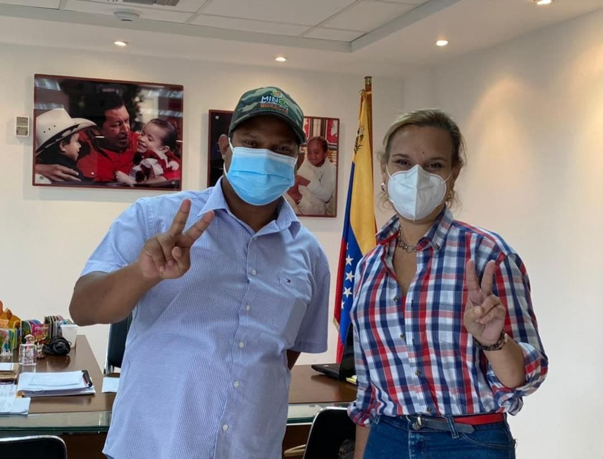
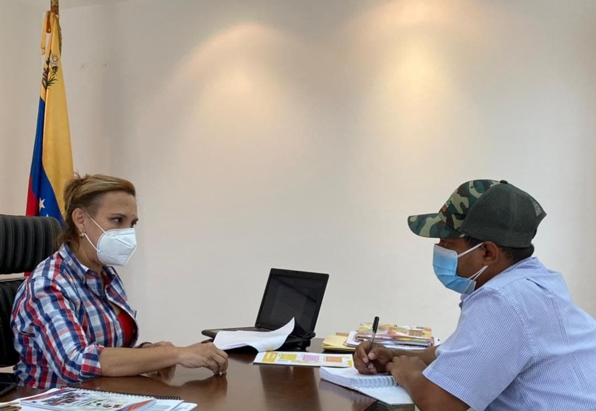
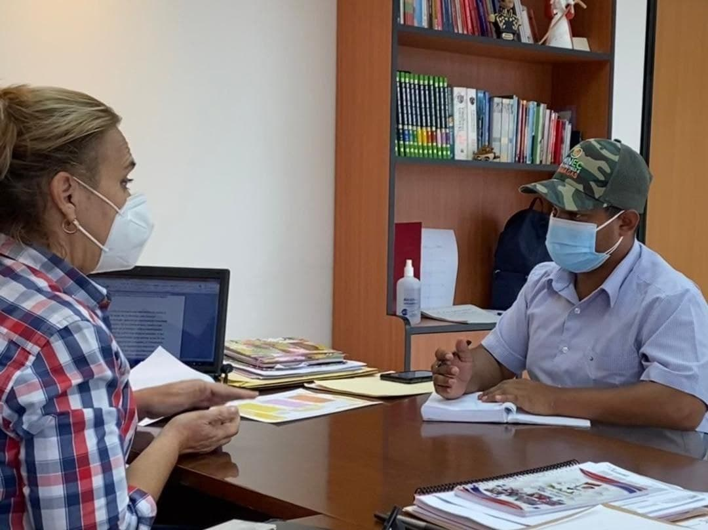

El  día de ayer 07/10/2021, la presidenta del IDENNA Dra. Luisaura Ravicini,  recibió la visita del presidente de la Misión Árbol Lcdo. Wilmer Vásquez en las instalaciones de la institución, con el propósito de encaminar alianzas estratégicas entre ambas instituciones, en relación a la vinculación de los planes que desarrollan en la actualidad.
Las autoridades destacaron la importancia de articular los planes y programas que despliegan ambas  instituciones  a nivel nacional y que buscan a través de los lazos de amor y de amistad que los une, dar cumplimiento a las instrucciones del presidente Nicolás Maduro con respecto a generar acciones que contribuyan a contrarestar los efectos del bloqueo criminal por el que atraviesa el país, y que sin duda alguna ha atentado contra la estructura familiar.

Ambas instituciones buscan crear canales de cooperación a través del trabajo en conjunto, que coadyuven al fortalecimiento y la consolidación de esfuerzos que permitan alcanzar la mayor suma de felicidad posible para nuestro pueblo.

Por ello se hace necesario dar cumplimiento a los objetivos institucionales fundamentales como los son: formar en nuestros niños, niñas y adolescentes en torno a una cultura de valores humanistas y ambientalistas, que crezcan amando la naturaleza como parte integral en el proceso de crianza, orientados a lo que establece el Plan de la Patria 2019-2025 en su Objetivo N°5 que hace referecia “hacia la construcción de modos de vida armónicos y de respeto de los derechos de la madre tierra y de todas y todos sus habitantes”, como garantía del legado del Comandante Chávez, quien siempre se preocupo por la conservación de la vida en el planeta y el impacto del cambio climático.

En esta reunión surgieron algunas propuestas por parte de las autoridades, como lo son: establecer convenios en materia  ambiental entre ambas instituciones, considerando sus planes banderas “Crianza Amorosa” y “Guardianes del Árbol”, basandose en la conformación de Eco-Brigadas con los niños y niñas que se encuentran en las diferentes entidades de atención , y que contribuirán  con la formación del semillero de la Patria en deberes, derechos y responsabilidades en materia de conservación ambiental; estas Brigadas Ecológicas estarían contempladas de igual forma en todos  los programas de prevención que desarrolla el IDENNA a través de sus 24 Direcciones Regionales, que permanecen en contacto con los sistemas municipales de protección que involucran los 335 municipios, lo que implicaría que se estarían creando (como un mínimo) de 335 Brigadas de Conservación y Ecosocialismo.
De igual forma señalaron,  la relevancia  de que los niños, niñas y jóvenes integren los diferentes programas y planes que desarrolla la Misión Árbol como actores sociales, que participen activamente en el cuidado de la naturaleza, contribuyendo así a dar soluciones y respuestas  en situaciones futuras.

Fuente: [IDENNA](https://idenna.vercel.app/idenna-y-mision-arbol-encaminados-a-realizar-alianzas-estrategicas/)
