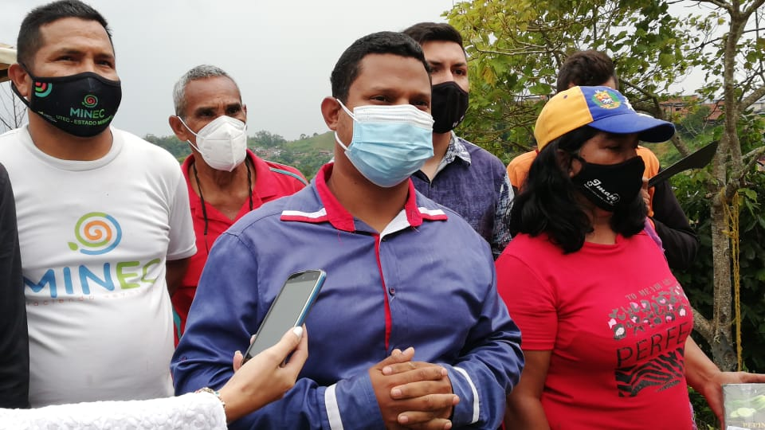
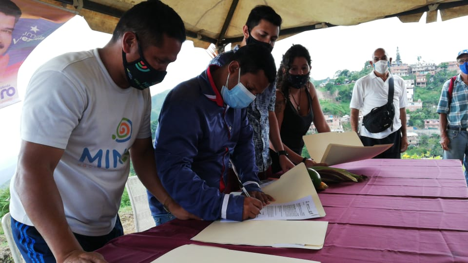
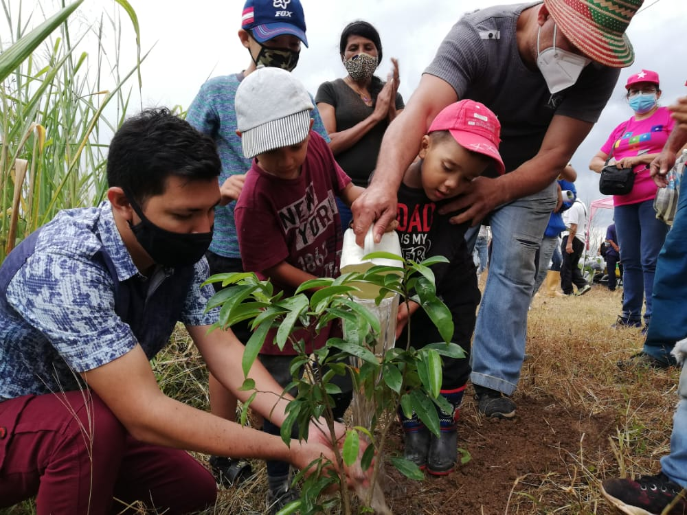
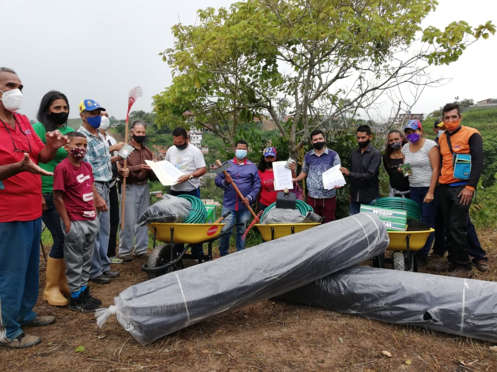

En la continuación del Plan Nacional de Viveros Comunitarios, el Ministerio del Poder Popular para el Ecosocialismo (Minec), a través de la Fundación Misión Árbol, puso en funcionamiento tres centros de producción de plantas en el municipio Guaicaipuro del estado Miranda.

El acto, que se realizó en la Escuela de Producción Agroalimentaria, Núcleo el Konuko, de la comuna Brisas de Palo Alto, estuvo liderado por el presidente de Misión Árbol, Wilmer Vásquez, en compañía del director de Desarrollo Comunal, Yonar Salazar, y la candidata del Partido Socialista Unido de Venezuela (Psuv) a concejal por el municipio Guaicaipuro, Sulimar Rengifo.

Vásquez indicó que se encontraba en el lugar junto con los comuneros y comuneras para entregar los tres viveros comunitarios que comenzarán a producir plantas frutales, forestales, ornamentales y medicinales y hortícolas.

“Estos viveros van a permitir el desarrollo del Poder Popular en materia ambiental y la recuperación de los espacios de estos sectores (…) Con esto llevamos Ecosocialismo al territorio para así cumplir con el Quinto Objetivo Histórico del Plan de la Patria”, afirmó.

Por su parte, María Lorca, parlamentaria de la Comuna Trincheras de la Revolución, agradeció al Minec, al ministro Josué Lorca, a los integrantes de la Misión Árbol y al personal de Unidad Territorial Ecosocialista (Utec) Miranda, por el apoyo que recibieron al concretarse las instalación de los viveros comunitarios.

“Con estos viveros se benefician 64 mil familias, 38 consejos comunales y aproximadamente 200 productores. Acá vamos a procesar diferentes rubros frutales, forestales y medicinales, de ciclos cortos, para apalancar el desarrollo productivo de la parroquia Los Teques del eje sur, y transitar hacia la construcción del estado comunal, a través del empoderamiento de las comunas”, dijo María Lorca.

En ese sentido, Roger Solórzano, de la Comuna San José de Guaremal y la Corporación Agroalimentaria Zamorana Guaremal en Tus Manos, también manifestó su agradecimiento a las autoridades del Ministerio y de la Misión Árbol.

“Estos viveros comunitarios vienen a dar un gran apoyo a todos los muchachos que están organizados sembrando y buscando plantas para reforestar en muchas partes que se han talado. Este acto de hoy nos ayuda y nos proyecta a mejorar el ambiente en el municipio”, señaló Solórzano.

En la reunión, el Minec otorgó a los voceros comuneros carretillas, machetes, bolsas para colocar las plántulas, mangueras, malla polisombra, palas, escardillas, una asperjadora, rastrillos y maderas para umbráculos.

 Los viveros impactarán a tres comunas que agrupan a 38 consejos comunales, con los que se espera consolidar los Comités Ecosocialistas y el programa Guardianes del Árbol, además de que se logre una producción de 26 mil 500 plantas.

*Prensa Ecosocialismo (Minec) / Michael Segovia / Misión árbol*

*Contacto / ecosocialismoprensa@gmail.com*

