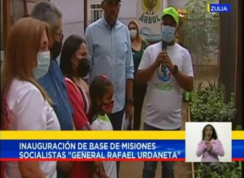

 Durante un pase en cadena Nacional  a través de Venezolana de Televisión (VTV), el Presidente de la Misión Árbol, Wilmer Vásquez, inauguró el primer vivero comunitario, en el estado Zulia.

La instalación fue una de las 118 Bases de Misiones puestas en funcionamiento en el país este miércoles, específicamente en el sector Punto Fijo 2, de la parroquia Jorge Hernández, del municipio Cabimas, “General Rafael Urdaneta”, mediante una alocución que dirigió el presidente de la República Bolivariana de Venezuela, Nicolás Maduro Moros, en conmemoración de los nueve años del “Golpe de Timón”, conducido por el Comandante Hugo Chávez.

 En este acto también estuvieron presentes el gobernador de la región, Omar Prieto, el alcalde de Cabimas, Pedro Duarte, y la ministra de Pueblos Indígenas, Roside González, para dar inicio, junto con los niños y niñas de la comunidad, de las operaciones del nuevo centro de producción de plantas, que procesará 12 mil plantas de distintas especies.

 “Este vivero comunitario producirá plantas forestales, frutales, ornamentales, medicinales y hortícolas. El proceso de producción va a ser realizado por la misma comunidad, los misioneros, niños, niñas, que conforman los Guardianes del Árbol, para luego ser establecidas en las distintas áreas degradadas y entregadas a los agroproductores de la zona”, dijo Vásquez.
 La autoridad de Misión árbol agregó que hay una alianza estratégica de viveros comunitarios, junto con el Ministerio de las Comunas, a cargo de la ministra Noris Herrera.

 “En cada consejo comunal estamos conformando Comités Ecosocialistas y en cada comuna estamos formando Consejos Ecosocialistas, que van a permitir el fortalecimiento del autogobierno y la transferencia de competencias al Poder Popular en el territorio, a través de los viveros comunitarios”, aseguró Vásquez.

 Hasta el momento se han se han entregado a nivel Nacional 31 viveros que tendrán la capacidad de producir 372 mil plantas como meta para el 2021, y para el 2022 se tiene previsto fortalecer la producción de un millón 200 mil plantas con 100 nuevos viveros comunitarios.

*Prensa Ecosocialismo (Minec) / Michael Segovia / Misión árbol*

*Fotografías / Harrison Ruíz / Amber Hernández*

*Contacto / ecosocialismoprensa@gmail.com*

