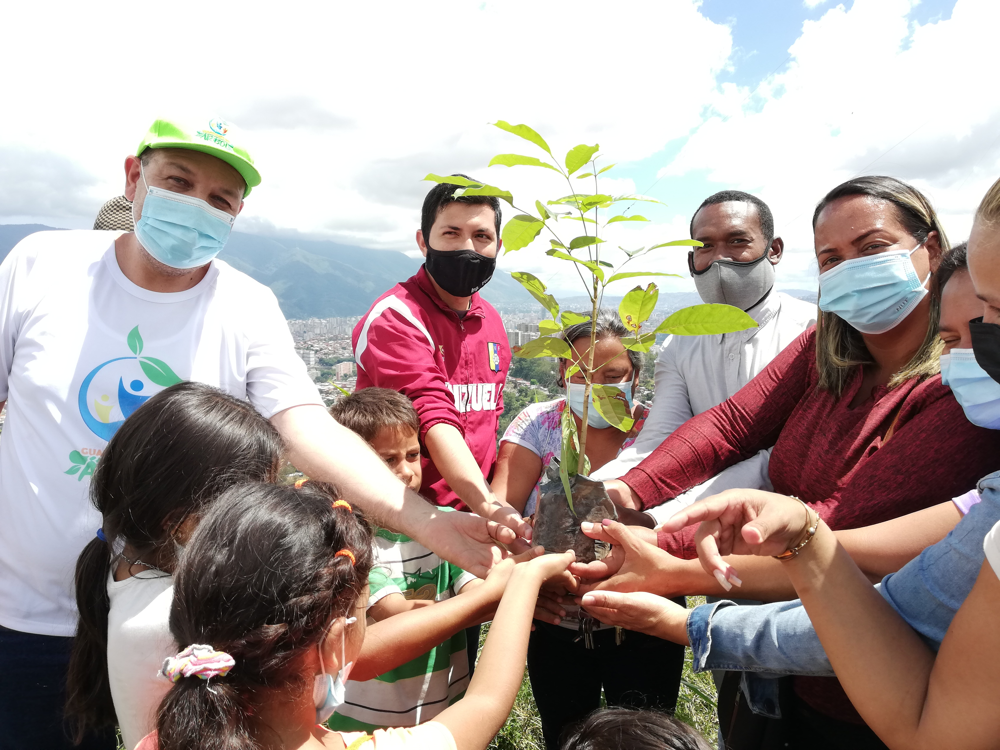

Prensa Misión Árbol (FMA) Caracas. Este miércoles 20 de octubre la Fundación Misión Árbol (FMA) se trasladó hasta la comunidad Mario Briceño en la calle continente del sector Cruz Baja, parroquia Sucre, para hacer entrega de plantas a los productores comunales que tienen una plantación de semillas de alta calidad.

La producción de alimentos de esta plantación se distribuye en la comunidad y busca garantizar la soberanía alimentaria del país, todo este trabajo se realiza gracias a la organización de la comunidad con el afianzamiento de su base de misiones.

El viceministro de Residuos y Desechos Sólidos del Minec, Luis Palacios junto a los representantes de la fundación Misión Árbol asistieron a la actividad para entregar personalmente 120 plantas frutales a los representantes de los 7 consejos comunales que están conformados en esta comunidad. El recién inaugurado programa Guardianes del Árbol ya se está desplegando en todo el país y esta comunidad no fue la excepción, 70 guardianes estuvieron presentes en la actividad para continuar con su formación en el cuidado y preservación de las especies vegetales.

*Prensa Ecosocialismo (Minec) / Michael Segovia / Misión árbol*

*Contacto / ecosocialismoprensa@gmail.com*

