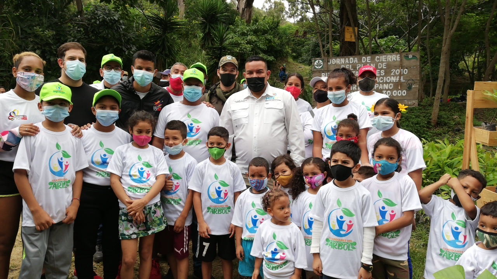
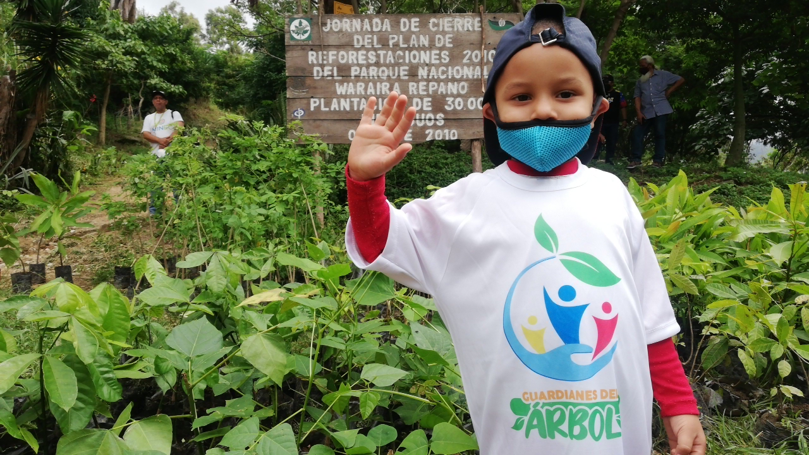

Para conmemorar el Día Internacional contra el Cambio Climático, el Ministerio del Poder Popular para el Ecosocialismo (Minec), desarrolló una jornada nacional de reforestación en la que se lograron establecer 16 mil plantas de forma simultánea.

En el acto central de plantación, realizado en el sector Mecedores del Semillero de Catuche, en la capital, estuvo el titular del Minec, Josué Lorca, quien indicó que solamente en la zona seleccionada del Waraira Repano se colocaron 3 mil árboles.

“Estamos plantando a nivel nacional 16 mil árboles y aquí en el Waraira Repano 3 mil, en el sector Catuche, un lugar que siempre es afectado por uno de estos flagelos por consecuencia del cambio climático, cada vez más fuerte, como son los incendios forestales”, indicó.

El Ministro señaló que la actividad es muy importante por ser resultado de una instrucción directa del presidente Nicolás Maduro, que ha sido “organizar, formar, trabajar y movilizar en torno a acciones concretas que contribuyan a combatir la crisis climática”.

“Este Día Internacional contra el Cambio Climático se inscribe dentro de una gran jornada mundial de concientización sobre las acciones que hace el ser humano e impactan directamente, para generar destrucción o degradación de manera acelerada en el planeta tierra”, aseguró.

Lorca manifestó que en Venezuela la jornada de reforestación se efectuó con todos los equipos del Minec, a los que se sumó las voluntades de los venezolanos e incluso la de pueblos hermanos como Turquía, que tuvo una representación a través del jefe adjunto de Misión de la República turca, señor Oğuzhan Öçbe.

“Nosotros desde Venezuela seguimos denunciando que no es culpa de la humanidad el cambio climático, la crisis climática que estamos atravesando, como quieren hacernos ver esos grandes países, sino que es culpa del sistema capitalista, al cual está sometido todo el planeta y todos estamos viviendo”, afirmó Lorca.

El diplomático turco agradeció la invitación a la reforestación que considera un evento importante porque la República de Turquía siempre apoya los esfuerzos de Venezuela para combatir el cambio climático.

Previo a la plantación se realizaron diversas acciones entre las que está el lanzamiento en gincana para los más jóvenes, mediante una línea armada por los bomberos forestales del Instituto Nacional de Parques (Inparques), explicaciones de las diferentes semillas propias del lugar que se recupera, por parte de la Misión Árbol y otras muestras ofrecidas por los integrantes del Cuerpo Civil de Guardaparques.

En la plantación participaron los pequeños Guardianes del Árbol, voluntarios, servidores del Minec e Inparques, guardaparques y bomberos forestales, así como la Misión Árbol.

*Prensa Ecosocialismo (Minec) / Michael Segovia / Misión árbol*

*Fotografías / Harrison Ruíz / Amber Hernández*

*Contacto / ecosocialismoprensa@gmail.com*

