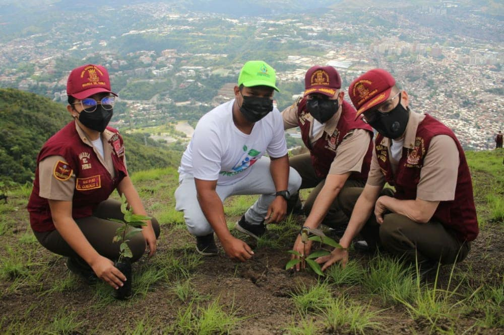
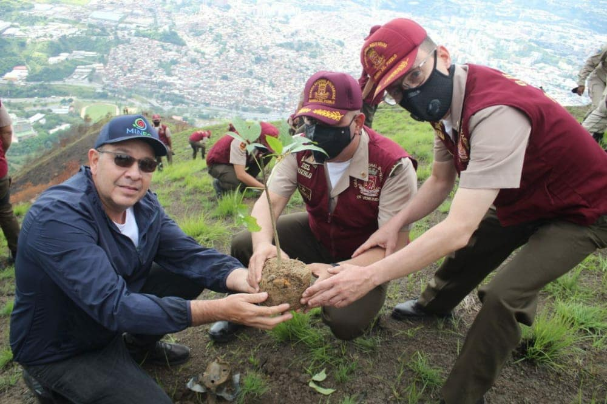

Parara celebrar el 10mo aniversario de la Guardia del Pueblo se llevó a cabo una jornada de reforestación a nivel nacional donde participaron funcionarios de la Guardia del Pueblo, trabajadores y voluntarios de la Misión Árbol en todas las entidades del país. 

En la ciudad de Caracas, el presidente de Misión Árbol Wilmer Vásquez junto al viceministro de Gestión Integral de la Basura del Minec, Luis Palacios, efectivos de la Guardia del Pueblo, Bomberos Forestales, Cuerpo Civil de Guardaparques e integrantes del Consejo Comunal Santa Rosa acompañado de la Guardia del Pueblo, trabajadores y voluntarios se dirigieron al sector Topo Arvelo del Parque Nacional Waraira Repano, que fue devastado por un incendio forestal hace unas semanas atrás provocado por un conductor eléctrico que además del incendio afectó el servicio en la capital.

En esta jornada es reflejo de la unión cívico militar que promovió el proyecto de Hugo Chavez y continúa el presidente Nicolás Maduro

Váquez afirmó que realizaron “una restauración ecológica con 500 árboles entre las especies de apamate, leucaena, majagua y yagrumo”, en el Warairarepano. Añadió que “aquí estamos recuperando e incentivando con la importancia de cumplir con el Quinto Objetivo Histórico, en unión cívico militar”.

La reforestación se realizó de forma simultánea a nivel nacional, y se colocaron más de dos mil 400 árboles entre frutales y forestales que contribuirán con la “restauración ecológica de las zonas afectadas, mejorará la biodiversidad y además asegurará los sitios de producción de agua, vital para nuestras comunidades”, expresó el viceministro durante la actividad.

*Prensa Ecosocialismo (Minec) / Michael Segovia / Misión árbol*

*Fotografías / Harrison Ruíz / Amber Hernández*

*Contacto / ecosocialismoprensa@gmail.com*

