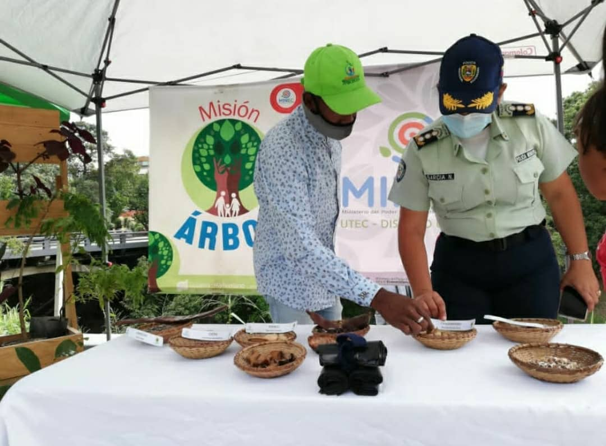
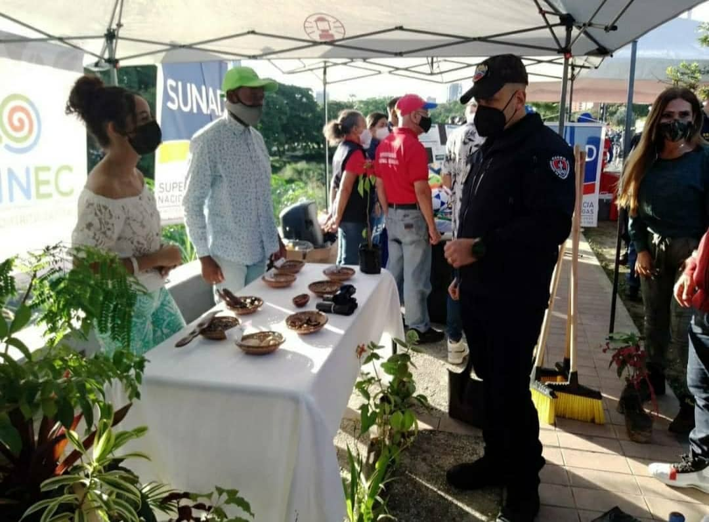

 Este 11 noviembre Misión Árbol participó junto a INPARQUES y los Bomberos Forestales en el lanzamiento del operativo  “Plan Navidades Seguras 2021", en la capital del país. En el marco de esta actividad también estuvieron presentes el vicepresidente de Seguridad Ciudadana y Paz, Remigio Ceballos  y el viceministro de Gestión de la Basura del MINEC Luis Palacios.

Durante la actividad, Misión  Árbol estuvo involucrando y sensibilizando al personal de seguridad sobre la importancia de las plantas, su manejo y cuidado para que las hagan parte del resguardo. 

Ceballos quién afirmó que, “nos encontramos dispuestos y prestos a cumplir nuestras tareas constitucionales. Garantizar la seguridad ciudadana en todo el territorio, en los distintos terminales de transporte, terrestre, acuático, aéreo, en las vías". Por su parte, el viceministro Palacios señaló que la participación que tenemos en este plan es porque el 46% de las zonas por las que se desplazan los viajeros son superficies bajo custodia del Minec”.

*Prensa Ecosocialismo (Minec) / Michael Segovia / Misión árbol*

*Fotografías / Harrison Ruíz / Amber Hernández*

*Contacto / ecosocialismoprensa@gmail.com*

