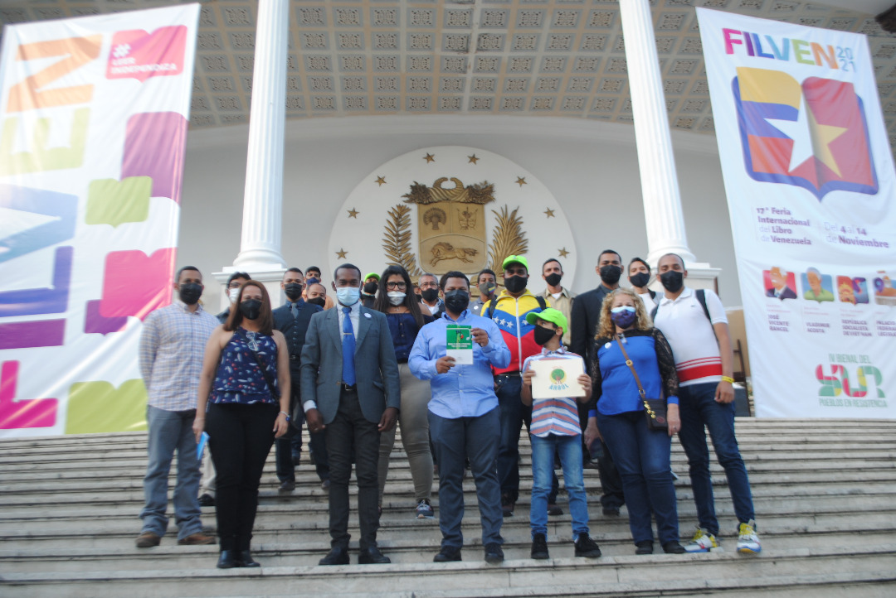
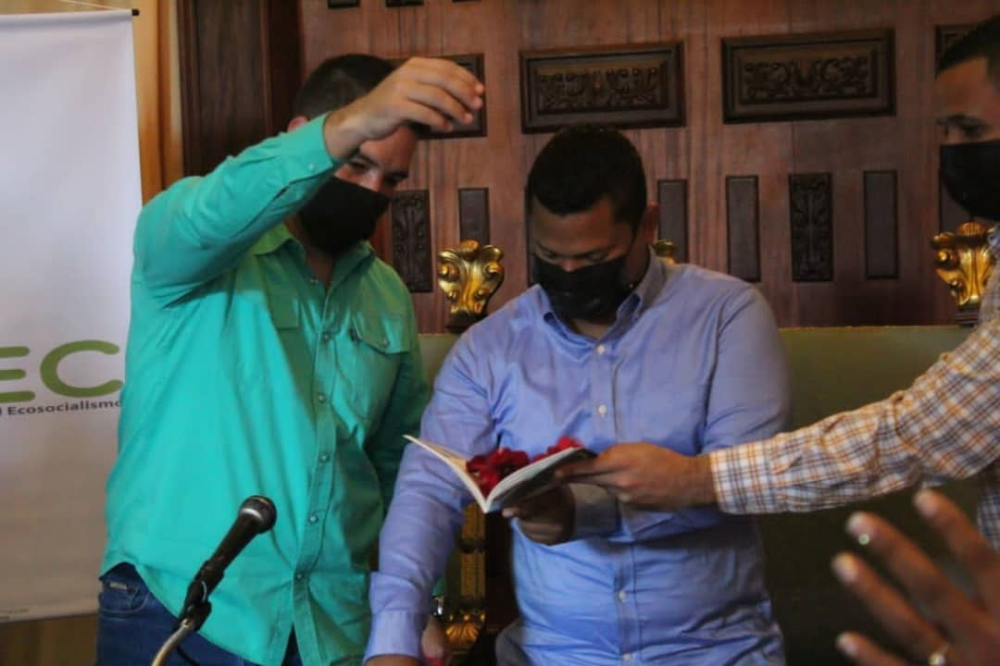
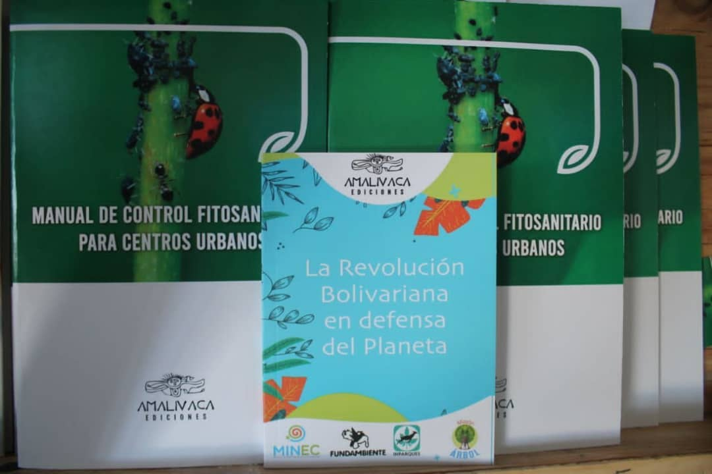

 El pasado 12 de noviembre el presidente de Misión Árbol, Wilmer Vásquez asistió a la XVII Feria Internacional del Libro de Venezuela 2021 que se lleva a cabo en las instalaciones del Palacio Federal Legislativo, en Caracas.

Desde allí, Vásquez presentó el “Manual de Control Fitosanitario Para Centro Urbanos”  junto al presidente de Fundambiente, Jesús Méndez. Ambos expresaron la importancia del control sobre la poda responsable de árboles en las comunidades para permitir su desarrollo sin impactar de manera negativa sus áreas verdes.

En el marco de esta feria, se presentaron otros títulos en materia ambiental que además marcan el relanzamiento de la editorial Amalivaca, que incentiva la investigación y escritura de esta área tan importante para la cotidianidad.

El manual nace de la necesidad de responder a las denuncias del pueblo, organismos y empresas, “no se está haciendo en algunos espacios el trabajo adecuado para realizar la poda y el mantenimiento de árboles que se debe, según la técnica que requiere para cuidar y preservar el árbol", dijo Vásquez. Este título representa un instrumento para el desarrollo de las potencialidades en materia de presentación ambiental de cada uno de los trabajadores y voluntarios que velan por el cuidado la naturaleza.

Durante la presentación también se resaltó la importancia de la lucha contra del cambio climático y de cómo se puede aportar para frenar este fenómeno con el control fitosanitario en las comunidades. Por último, las autoridades presentes extendieron la invitación al pueblo para que asista a la feria y visite el stand de Amalivaca Ediciones donde encontrarán este y otros títulos en materia de ambiente que son de interés para todas las personas que son sensibles a los temas ecológicos.

*Prensa Ecosocialismo (Minec) / Michael Segovia / Misión árbol*

*Fotografías / Harrison Ruíz / Amber Hernández*

*Contacto / ecosocialismoprensa@gmail.com*

