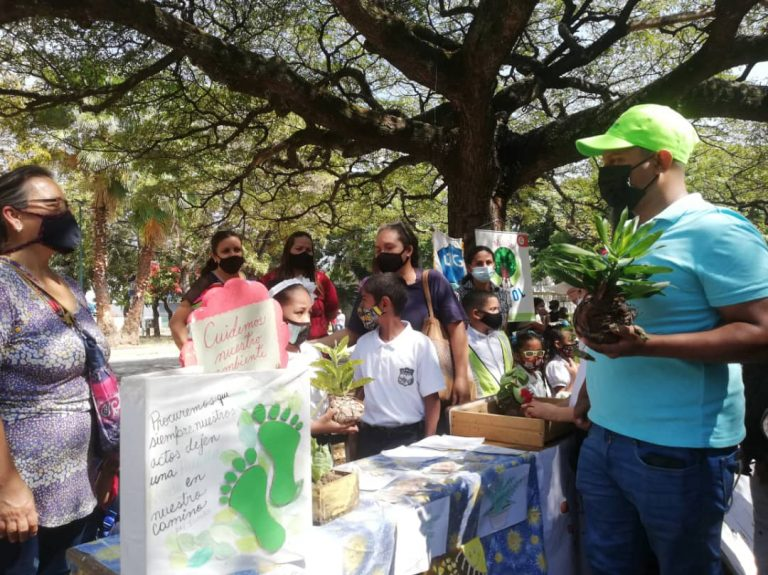
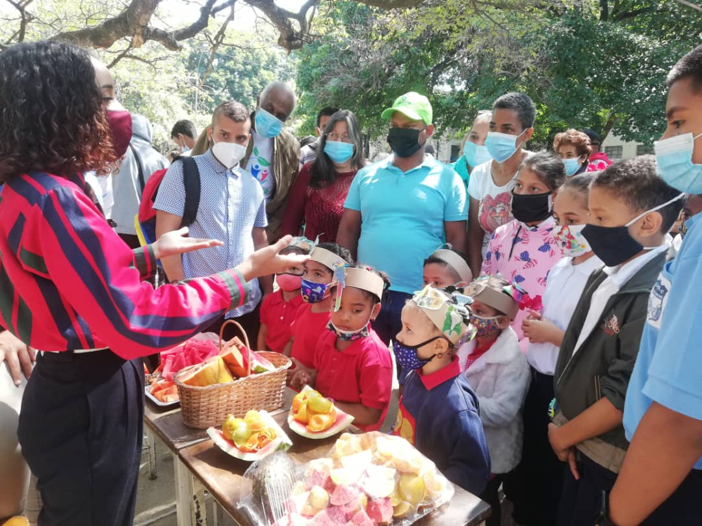
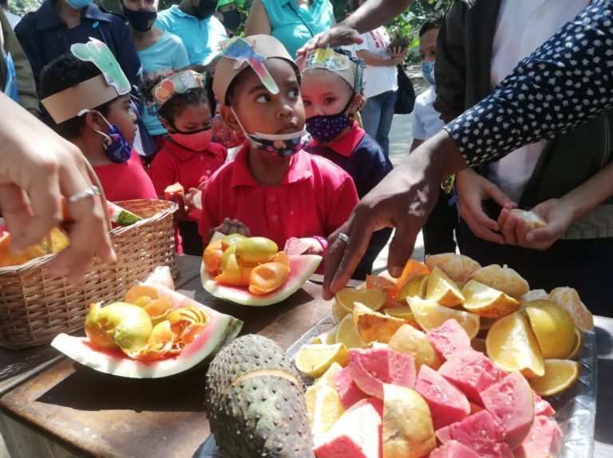

 La Misión Árbol, ente adscrito al Ministerio del Poder Popular para el Ecosocialismo (Minec), se desplegó a nivel nacional en las instituciones educativas, en procura del desarrollo de la conciencia de los estudiantes en material ambiental, con motivo de celebrarse este miércoles el Día Internacional de la Educación Ambiental.

En Caracas, el presidente de la Fundación Misión Árbol, Wilmer Vásquez, encabezó los actos que se realizaron en la Unidad Educativa Nacional Gran Colombia, ubicada en el sector Prado de María de la parroquia Santa Rosalía.

Vásquez indicó que «el tema que hoy llevamos a las instituciones educativas fue la preservación de las semillas forestales y frutales».

«Explicamos cómo se hace la recolección, producción y mantenimiento. Cómo podemos hacer reservorios de semillas en las instituciones, como producir un árbol en cada plantel», señaló.

Agregó que «vimos las distintas experiencias que a nivel nacional hay en el Sistema Educativo con los maestros y el Movimiento Bolivariano, el Frente Fernanda Bolaños, la Organización Bolivariana Estudiantil (OBE) y la Federación Venezolana de Estudiantes de Educación Media».

«En el caso de la Gran Colombia, estuvimos con los estudiantes desde preescolar hasta la Escuela Técnica, para compartir las experiencias de cada uno en materia ecosocialista», dijo.

Comentó que vio las muestras «en producción de abono orgánico, en la recolección de semillas frutales y de ciclo corto, además observamos la forma de reproducción de plantas que tienen».

«Hay una experiencia inédita en este espacio, en el que se suman incluso los niños con discapacidad auditiva que aportan a la lucha por el ambiente», apuntó.

Como objetivo la Misión se planteó concientizar a la población estudiantil, sobre la importancia del consumo de las frutas y el proceso de la preservación de las semillas, para así garantizar la variedad genética de las especies frutales.

«Aquí comenzamos con la campaña #AmigosDelFruto, la cual consiste en la recolección de diversas semillas frutales en los planteles, para que estas contribuyan con los programas de los bosques policromáticos», finalizó.

*Prensa Ecosocialismo (Minec) / Michael Segovia / Misión árbol*

*Fotografías / Harrison Ruíz / Amber Hernández*

*Contacto / ecosocialismoprensa@gmail.com*

