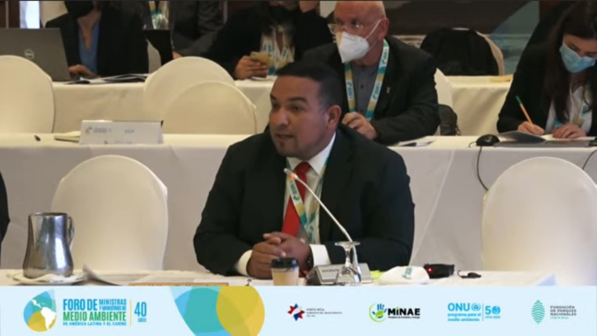

Durante el encuentro conmemorativo del 40 aniversario del Foro de Ministros y Ministras del Medio Ambiente de América Latina y el Caribe, el titular del Ecosocialismo en Venezuela, Josué Lorca, disertó sobre las realidades del continente y puso a disposición de las delegaciones asistentes, las experiencias venezolanas en el tema.

El Ministro agradeció en la plenaria por la invitación al Estado venezolano a la reunión y señaló que «estamos comprometidos cada día más en trabajar por un ambiente más sostenible y sustentable».

«Nosotros creemos que es necesario ajustar y fortalecer los medios de financiamiento a nivel de América Latina y adaptarlos a nuestras realidades», indicó.

Agregó que «las fronteras geográficas o que imponen nuestros Estados, no lo son así para el ambiente y las realidades comunes que tenemos como continente».

Sostuvo que «creo que este es un espacio para destacar y hacer un llamamiento a que nos miremos hacia dentro, a que nos revisemos y tal vez nos podamos juntar, más allá de las diferencias políticas, en este objetivo global que es salvar al planeta tierra, que es salvarnos nosotros como especie humana y también salvar a todas las demás especies del planeta, y garantizar nuestra subsistencia para las próximas generaciones».

«Yo estoy seguro que si todos nos deslastramos más allá de los colores y ponemos sobre la mesa cuáles son las iniciativas que tiene cada país de este continente en materia de ambiente, nosotros podemos avanzar muchísimo más y podemos decirle a los mecanismos de financiamiento globales ‘mira nosotros somos diferentes a Europa, a Asia, porque tenemos unas burocracias propias de cada país'», afirmó.

Aseguró que «tenemos métodos políticos diferentes pero con realidades comunes y nos parecemos muchísimo, más de lo que nosotros mismos creemos».

«Venezuela pone a disposición algunas de sus iniciativas. Nosotros tenemos grandes fortalezas en materia de incendios forestales, tenemos una Universidad que dicta especialmente una licenciatura en incendios forestales, para el combate de estos. La hemos puesto a disposición del Alba y la Celac, para hacer algunos intercambios», explicó.

Apuntó que «tenemos una universidad específicamente para el ambiente, con carreras en materia ambiental. Tenemos programas de conservación de especies y de erradicación de especies invasoras como por ejemplo el pez león o el coral xenia, que ahora ha cambiado de nombre y amenaza a toda la costa del Caribe y es un problema común de toda el área caribeña».

«Ponemos a disposición datos, métodos, mecanismos, técnicas para control», manifestó.

Comentó que «nosotros tenemos el orgullo de decir que poseemos una de las más grandes hidroeléctricas del país. El 80% del consumo de eléctrico es una energía limpia, que proviene de centrales hidroeléctricas».

«También tenemos el 43% del país protegido en figuras de alta restricción como parques nacionales y monumentos naturales, lo que nos permite a nosotros tener un poco de experiencia que ponemos a disposición en materia formación de lo que nosotros llamamos guardaparques y en otros países llaman guadabosques. Tenemos más de 20 mil hombres y mujeres formados en esta materia», aseveró.

Asimismo, planteó que «quiero poner nuestro Ministerio, nuestro Estado a la disposición de la América completa para hacer trabajos en común y avanzar en cuanto a preservar nuestro ecosistema».

*Prensa Ecosocialismo (Minec) / Michael Segovia / Misión árbol*

*Fotografías / Harrison Ruíz / Amber Hernández*

*Contacto / ecosocialismoprensa@gmail.com*
