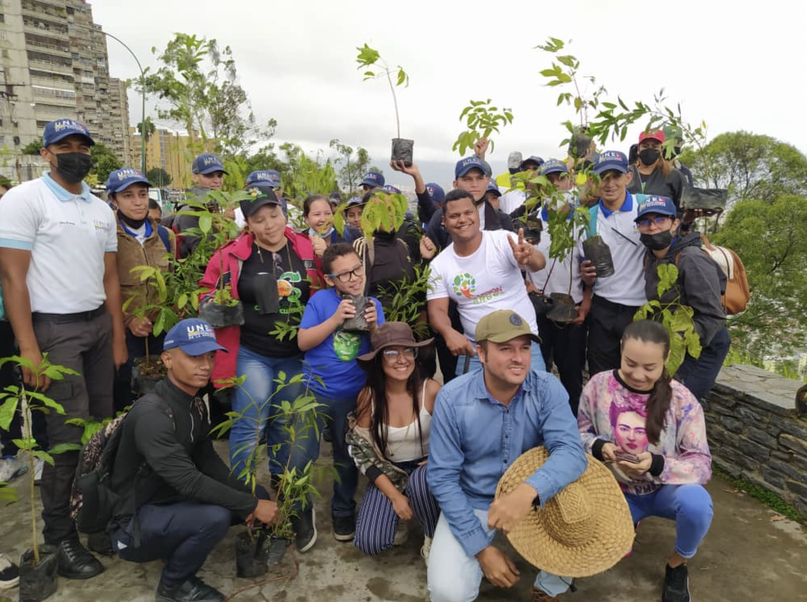
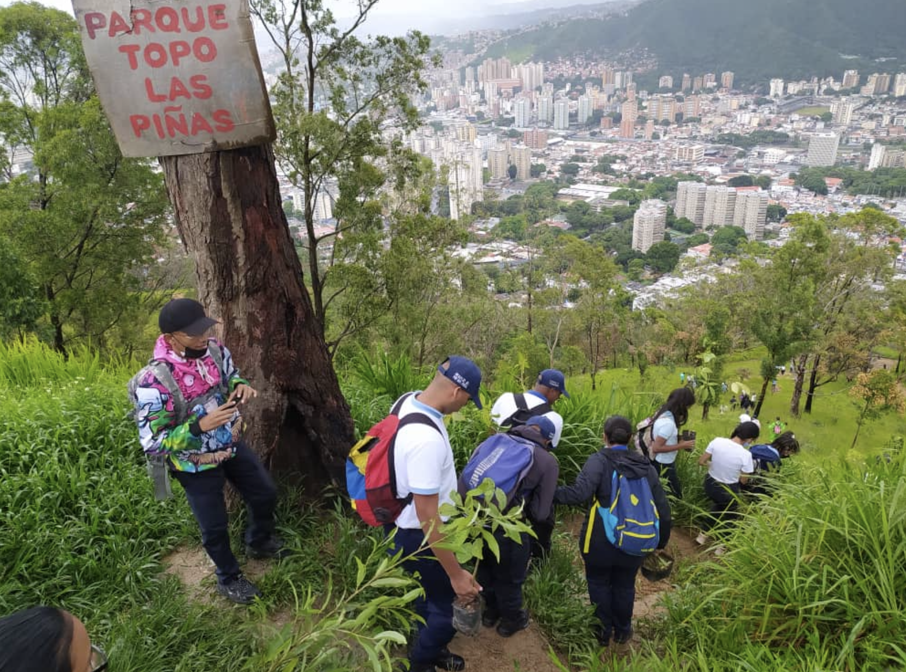
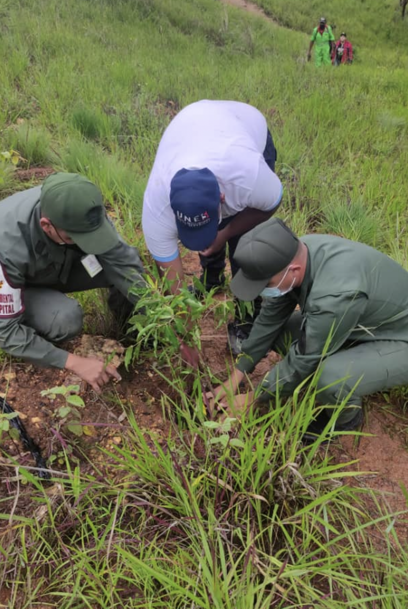

***Prensa FMA***. Este martes 12 de julio, desde el parque Topo Las Piñas, ubicado en la parroquia Sucre del municipio Libertador de Caracas, se realizó la plantación de 600 árboles frutales y forestales para la reforestación de esta área. Con ello se da cierre a la primera etapa del Programa Un Estudiante, Un Árbol como parte del Plan Nacional de Reforestación 2022-2023. 

La actividad se llevó a cabo con los estudiantes de bachillerato de la Unidad Educativa José López Cárdenas y otros más de la Universidad Nacional Experimental para la Seguridad (UNES) con el apoyo de Misión Árbol Distrito Capital. Ambos niveles académicos cumplen con el compromiso de aportar a la naturaleza y a la patria.\
\

Al cierre de este año escolar 2021-2022 el programa Un estudiante, Un árbol recorrió el país plantando vida a través de los futuros bachilleres, quienes cumplen con esta labor como requisito para obtener su título académico.

En el lugar estuvo presente el presidente de la Misión Árbol, Wilmer Vásquez quien acompañó y orientó a los estudiantes sobre la manipulación de la planta antes y durante el proceso de plantación.  El director nacional de la UTEC también dijo presente junto a la directora de la UTEC Capital Marlyn Jiménez quien expresó a los estudiantes su agradecimiento por la participación y los instó a seguir luchando por el país con este tipo de jornadas que buscan la recuperación del planeta.

